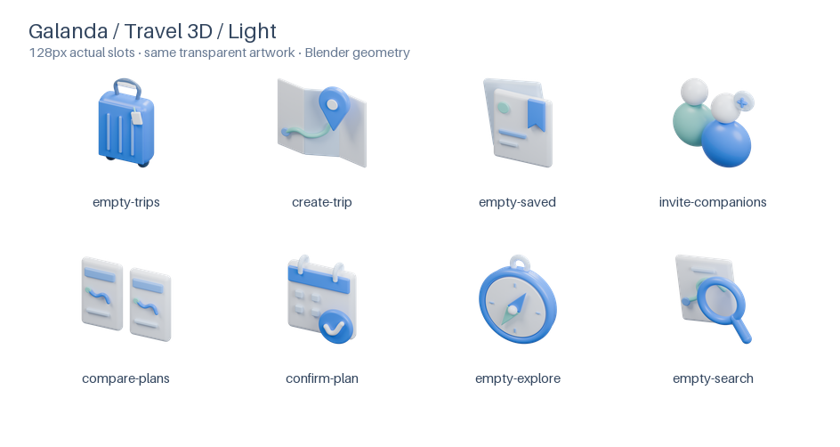
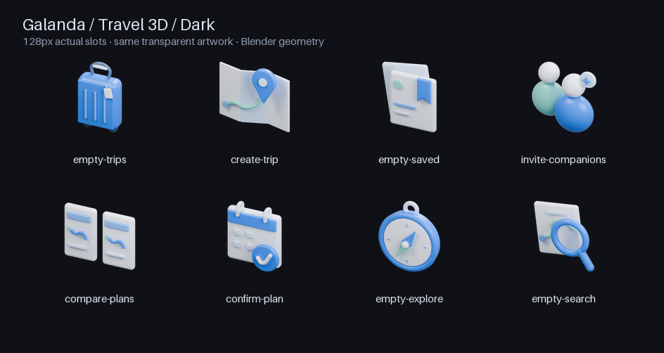

# 갈라고 3D 여행 에셋 원본

기존 8개 `GalandaSpot`을 실제 Blender 모델에서 렌더링한 투명 이미지로 교체합니다. 화면의 상태 판단·행동·레이아웃은 바꾸지 않습니다.

## 파일 구조

- `build_assets.py`: 외부 파일 없이 모든 mesh·curve, 재질, 카메라, 조명을 생성하는 Blender Python
- `export_assets.py`: RGBA PNG에서 alpha WebP와 라이트·다크 미리보기, 크롭/투명도 검증 결과를 생성
- `validate_models.py`: 저장된 `.blend` 8개를 별도로 다시 열어 geometry·camera·material·alpha 설정을 검증
- `model-validation.json`: 실제 저장 파일 재오픈 검증 결과
- `asset-manifest.json`: 현재 앱에 반영한 파일의 규격·크기·검증 정보
- `VALIDATION.md`: 이번 변경의 실제 검증 결과와 한계
- `legacy-svg/`: 이전 SVG 16개 원본 보관. 앱에 배포하지 않음
- `../../public/assets/galanda/spots-3d/`: 앱이 사용하는 384px WebP 8개

개별 `.blend`, 768px PNG와 여러 크기의 WebP는 별도 원본 ZIP에 함께 제공합니다. 저장소에는 생성 코드와 배포 이미지 위주로 보관해 앱/저장소 용량을 제한합니다.

## 재생성

Blender 4.3.2, Python 3 + Pillow로 생성했습니다. Node/pnpm 설치나 앱 실행에는 Blender/Pillow가 필요하지 않습니다.

```bash
# 저장소 루트에서 실행, 새 출력 폴더 사용
blender -b --python design/travel-assets/build_assets.py -- \
  --output /tmp/galanda-travel-assets --resolution 768 --samples 512
python3 design/travel-assets/export_assets.py --root /tmp/galanda-travel-assets
blender -b --python design/travel-assets/validate_models.py -- --root /tmp/galanda-travel-assets
# 결과를 검토한 다음 배포용 384px 파일만 복사
for file in /tmp/galanda-travel-assets/web/*-384.webp; do
  name="$(basename "$file" -384.webp)"
  cp "$file" "public/assets/galanda/spots-3d/$name.webp"
done
```

한 모델만 수정할 때는 Blender 명령에 `--assets empty-trips`처럼 이름을 지정합니다. 모델 생성만 확인할 때는 `--no-render`를 추가합니다. 개별 `.blend`에서 ASSET 컬렉션은 실제 편집 가능한 도형이고 STUDIO 컬렉션은 공통 조명·카메라입니다. 배경 plane이나 바닥 그림자는 없습니다.

## 128px 실제 표시 크기




## 시각 규격

- 같은 3/4 직교 카메라, 부드러운 공통 조명, 둥근 모서리와 파랑·아이보리·민트 팔레트
- 실제 silhouette 기준으로 약 78.5% 최대 축 점유율, 가장자리 잘림 없는 여백
- 단일 중립 팔레트로 밝고 어두운 화면에 모두 사용. 그림자 필터나 흰 바탕을 합성하지 않음
- 원본 768px, 앱용 384px, 표시 128px. WebP 한 파일당 80KB·8종 합계 400KB 이하
- 그림 내부 텍스트 없음. 제목과 설명이 의미를 소유하며 모델은 장식 요소

## 확인 순서

1. 768px RGBA PNG와 128px 접촉 시트에서 형태·재질·노이즈·의미 확인
2. 라이트·다크 배경에서 투명 가장자리와 여백 확인
3. Blender로 `.blend`를 다시 열어 실제 mesh/curve·카메라·재질 확인
4. 에셋 계약 및 기존 상태별 component test, `pnpm check`
5. 지원되는 브라우저에서 `/dev#assets` 및 `/dev#feedback` 확인. 실제 인증 앱/설치형 PWA/AIT 실기기와 개발 카탈로그를 구분해서 기록

[적용 위치·상태 의미](../../public/assets/galanda/spots-3d/README.md)
