# 갈란다 화면 흐름 및 화면 명세

## 1. 문서 목적

이 문서는 [갈란다 그룹 여행 의사결정 제품 정의서](./2026-08-14-galanda-group-trip-product-brainstorm.md)를 화면 흐름과 화면별 요구사항으로 구체화한다. 제품의 문제·타깃·MVP 경계는 제품 정의서에서 관리하고, 이 문서에서는 사용자가 보는 정보·행동·상태를 관리한다.

현재 확정 범위는 전체 화면 구조, 여행 목록, `계획` 탭의 홈·여행안 상세·편집·비교와 `일정` 탭 홈이다. 다른 화면은 이후 논의하면서 같은 문서에 추가한다.

## 2. 내비게이션 기준

- 화면 상단에는 앱인토스 전용 내비게이션 바와 TDS `TopNavigation`을 사용한다.
- 여행방 안에서는 TDS `Tab`으로 `계획`과 `일정`을 전환한다.
- 여행안 확정 전에는 `계획`을 기본 탭으로 연다.
- 여행안 확정 후에는 `일정`을 기본 탭으로 열되, `계획`의 검토 기록은 계속 접근할 수 있다.
- MVP에서는 별도의 하단 탭바를 두지 않는다.
- 초대 링크나 알림은 필요한 여행방과 화면으로 바로 진입한다.

## 3. MVP 화면 목록

| ID | 화면 | 핵심 목적 | 명세 상태 |
|---|---|---|---|
| `TR-01` | 여행 목록 | 참여 중인 여행을 찾고 새 여행을 만든다 | 최종 확정 |
| `TR-02` | 여행방 만들기 | 여행방과 첫 여행안을 시작한다 | 최종 확정 |
| `IN-01` | 초대장 | 초대 맥락을 확인하고 토스 로그인으로 참여한다 | 예정 |
| `PL-01` | 계획 탭 홈 | 여행안 현황을 파악하고 다음 행동을 선택한다 | 최종 확정 |
| `PL-02` | 여행안 상세 | 일정과 판단 근거를 검토하고 의견을 남긴다 | 최종 확정 |
| `PL-03` | 여행안 편집 | 기본안 또는 복제한 대안을 작성한다 | 최종 확정 |
| `PL-04` | 여행안 비교 | 안별 차이와 구성원 의견을 비교하고 확정한다 | 최종 확정 |
| `IT-01` | 일정 탭 홈 | 확정된 공동 일정을 날짜별로 사용한다 | 최종 확정 |

## 4. 핵심 화면 흐름

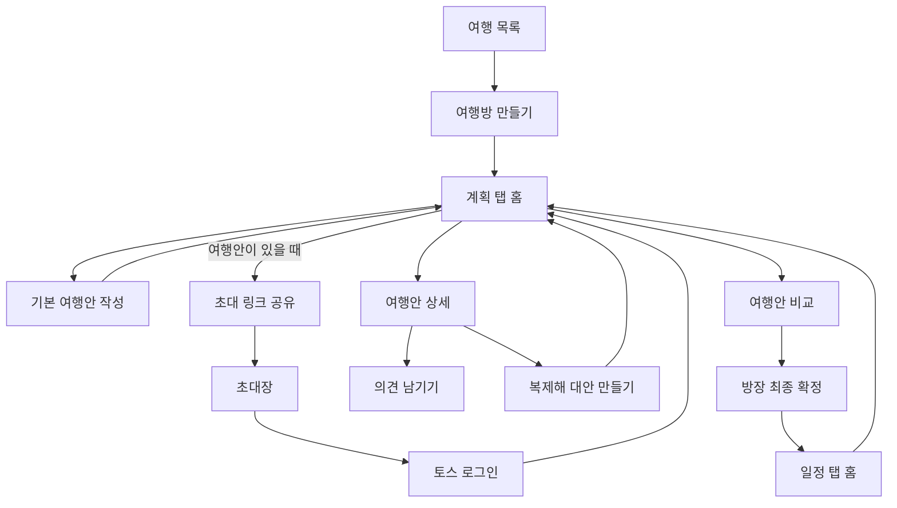

## 5. `PL-01` 계획 탭 홈

### 화면 역할

계획 탭의 첫 화면은 상세 일정표가 아니라 의사결정 현황판이다. 사용자는 이 화면에서 다음 세 가지를 바로 이해해야 한다.

1. 지금 여행이 어느 단계인지
2. 어떤 여행안이 제안되었고 무엇이 다른지
3. 내가 다음으로 해야 할 행동이 무엇인지

### 진입 조건

- 여행방 참여가 완료된 사용자만 볼 수 있다.
- 여행안 확정 전에는 여행방의 기본 진입 화면이다.
- 여행안 확정 후에는 `계획` 탭을 선택해 검토 기록으로 들어온다.

### 정보 배치 순서

#### 1. 상단 내비게이션

- 뒤로가기
- 여행방 이름: 예) `일본 여행`
- 방장에게만 초대 링크 공유 액션
- 설정 또는 나가기와 같은 낮은 빈도의 행동은 더보기 메뉴에 배치

#### 2. 콘텐츠 탭

- `계획`: 선택 상태
- `일정`: 미확정 상태에서도 노출하되, 선택하면 일정 확정이 필요하다는 빈 상태를 보여준다.

#### 3. 진행 상태 요약

페이지에서 가장 먼저 읽히는 정보다. 숫자 자체보다 현재 단계와 다음 행동을 설명한다.

예시:

- `여행안을 고르고 있어요`
- `4명 중 3명이 의견을 남겼어요`
- `내 의견을 기다리는 여행안이 2개 있어요`
- `B안으로 일정을 확정했어요`

한 화면에 여러 안내를 쌓지 않고 사용자에게 가장 중요한 안내 하나만 보여준다.

#### 4. 여행안 목록

- 확정 전에는 기본안을 먼저, 대안은 만들어진 순서대로 보여준다.
- 자동 인기순 정렬이나 추천 점수는 사용하지 않는다.
- 확정 후에는 선택된 안을 `확정` 상태로 맨 위에 고정하고, 나머지는 `검토했던 여행안`으로 구분한다.
- 여행안이 많아져도 MVP에서는 검색·필터·정렬 기능을 추가하지 않는다.

#### 5. 하단 핵심 행동

현재 상태에 따라 하나의 핵심 행동만 TDS `BottomCTA`로 제공한다.

| 상태 | 핵심 행동 |
|---|---|
| 여행안 없음 | `첫 여행안 만들기` |
| 여행안 1개 | `새 여행안 제안하기` |
| 여행안 2개 이상 | `여행안 비교하기` |
| 여행안 확정 | `확정 일정 보기` |

`새 여행안 제안하기`는 기존 안을 선택해 복제하는 흐름으로 연결한다. 최종 확정 버튼은 계획 탭 홈이 아니라 비교 화면에서 방장에게만 제공한다.

### 여행안 카드 정보

카드는 모든 세부 내용을 담지 않고, 안 사이의 차이를 판단하는 최소 정보만 보여준다.

| 우선순위 | 정보 | 예시 |
|---|---|---|
| 1 | 안 이름과 상태 | `A안 · 기본안` |
| 2 | 전체 날짜 | `10월 7일~10일 · 3박 4일` |
| 3 | 도시별 체류 | `도쿄 1박 → 오사카 2박` |
| 4 | 원본과의 차이 | `도쿄 +1박 · 오사카 -1박` |
| 5 | 예상 비용 | `그룹 총액 336만원 · 4명 기준 · 1인 예상 84만원` |
| 6 | 예약 상태 요약 | `숙소 1개 확인 필요` |
| 7 | 의견 현황 | `좋아요 2 · 괜찮아요 1 · 어려워요 1` |
| 8 | 제안자와 내 의견 | `민지 제안 · 나는 아직 의견 전` |

- 가격에는 비용 기준 인원과 확인 시각을 함께 표시한다.
- 도시 경로는 시각안 2의 압축 경로 레일로 표시한다. 도시명 아래에 체류 박수를 두고 이동 순서대로 연결한다.
- 4개 도시까지는 한 화면에 모두 노출한다. 5개 이상은 줄바꿈하지 않고 가로로 탐색하며, 다음 도시 일부를 보여 더 있다는 점을 알린다.
- 도시 수와 무관하게 원본과 달라진 체류 박수는 경로 아래의 별도 문장으로 표시한다.
- 예약 링크와 숙소·교통의 상세 내용은 카드가 아니라 여행안 상세에서 보여준다.
- 색상만으로 예약 상태나 의견을 구분하지 않고 텍스트를 함께 제공한다.
- 카드를 선택하면 여행안 상세로 이동한다.
- 편집과 삭제는 작성자에게만 더보기 메뉴로 제공한다.

### 사용자별 차이

#### 방장

- 초대 링크를 공유할 수 있다.
- 자신이 만든 여행안을 수정할 수 있다.
- 비교 화면에서 최종안을 확정할 수 있다.
- 아직 의견을 남기지 않은 인원을 확인할 수 있다.

#### 참여자

- 모든 공개 여행안을 볼 수 있다.
- 여행안마다 의견을 남길 수 있다.
- 기존 여행안을 복제해 대안을 제안할 수 있다.
- 자신이 제안한 대안을 수정할 수 있다.
- 다른 사용자의 여행안을 직접 수정하거나 최종 확정할 수 없다.

### 상태별 화면

#### 여행안이 없을 때

- 빈 목록 대신 `첫 여행안을 만들어 친구들과 비교해 보세요`를 보여준다.
- 핵심 행동은 `첫 여행안 만들기`다.
- 비교와 초대 액션은 노출하지 않는다.

#### 의견을 모으는 중

- 진행 상태와 여행안 목록을 함께 보여준다.
- 사용자가 아직 의견을 남기지 않은 안을 텍스트로 구분한다.
- 여행안이 두 개 이상이면 `여행안 비교하기`를 핵심 행동으로 제공한다.

#### 여행안이 확정됐을 때

- 확정된 안을 맨 위에 고정한다.
- 핵심 행동은 `확정 일정 보기`다.
- 다른 안과 의견 기록은 `검토했던 여행안`에서 계속 볼 수 있다.
- 계획 탭에서는 확정 일정을 직접 편집하지 않는다.

### 화면 밖으로 분리하는 정보

다음 정보는 계획 탭 첫 화면에 넣지 않는다.

- 숙소·교통 예약 링크 전체
- 날짜별 핵심 장소의 상세 목록
- 구성원의 `어려워요` 사유 전문
- 여행안 편집 입력 폼
- 최종 확정 확인 절차
- 확정 일정 편집

각 정보는 여행안 상세, 비교 또는 일정 화면에서 다룬다.

### 완료 조건

- 사용자는 화면 상단에서 현재 여행 단계와 다음 행동을 알 수 있다.
- 사용자는 여행안 상세를 열지 않아도 날짜, 도시별 체류, 비용, 예약 문제의 차이를 파악할 수 있다.
- 여행안이 두 개 이상이면 한 번의 행동으로 비교 화면에 갈 수 있다.
- 방장과 참여자에게 허용되지 않은 행동이 노출되지 않는다.
- 확정 전과 확정 후에 계획 기록이 사라지지 않는다.

## 6. `PL-01` 시각 탐색

확정된 정보 구조를 기준으로 이미지 생성 도구의 기본 모드에서 세 가지 모바일 화면을 만들었다. 모두 `390×844` 비율, TDS 상단 내비게이션, `계획 | 일정` 탭, 여행안 두 개, 단일 `여행안 비교하기` CTA를 공통으로 유지한다.

### 시각안 1

선형 목록형 정보 구조다. 진행 상태 다음에 두 여행안을 하나의 목록으로 이어서 보여준다.

[원본 이미지 열기](../assets/pl-01/pl-01-option-1.png)

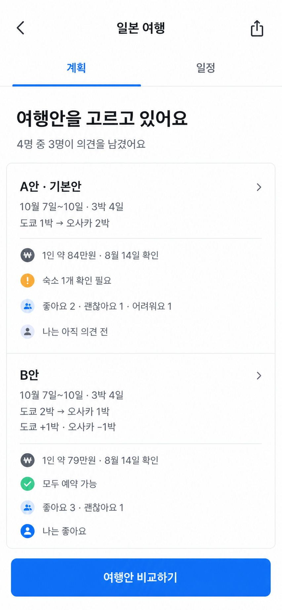

### 시각안 2

**최종 확정안.** 도시별 체류 차이를 가장 먼저 비교하는 구조다. 최초 시안은 두 도시를 큰 시각 요소로 보여줬고, 선택 후 다도시 여행을 고려한 압축 경로 레일로 수정했다.

[원본 이미지 열기](../assets/pl-01/pl-01-option-2.png)

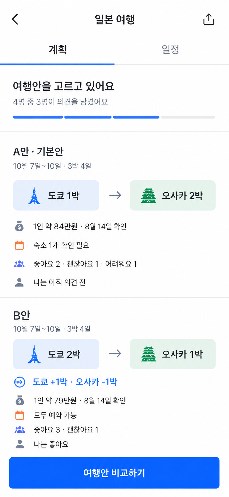

[최종 확정 시안 열기](../assets/pl-01/pl-01-option-2-multi-city.png)

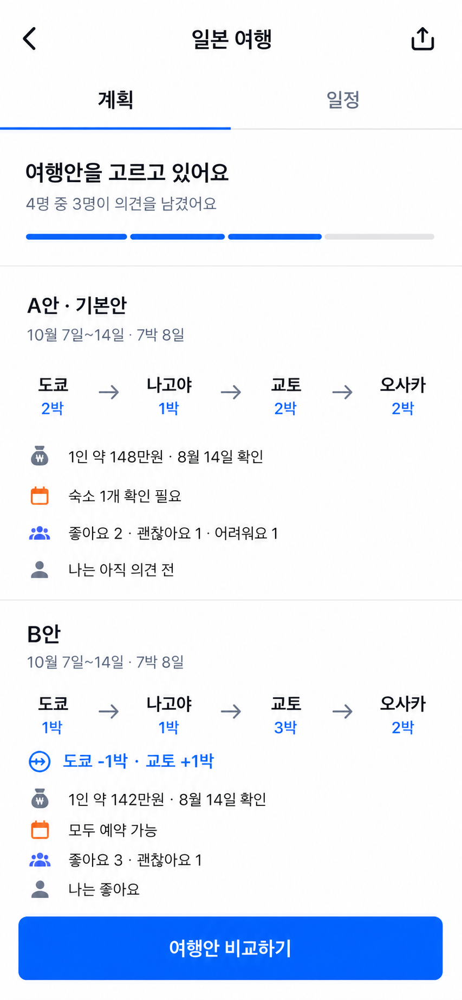

### 시각안 3

사용자에게 남은 행동을 가장 먼저 보여주는 구조다. 각 여행안에서 `내 의견` 상태를 강조한다.

[원본 이미지 열기](../assets/pl-01/pl-01-option-3.png)

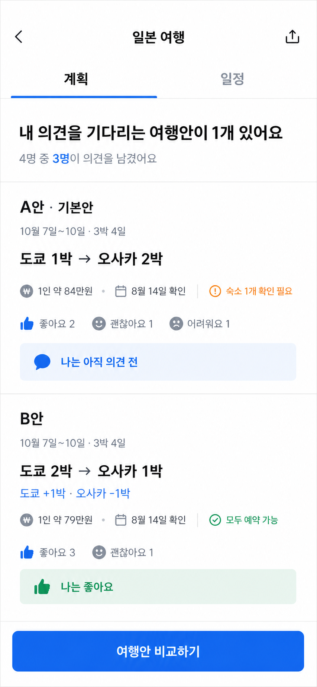

### 생성 프롬프트 기준

- 공통: 실제 구현 가능한 한국어 모바일 UI, 앱인토스/TDS 관례, 흰색 기반 화면, 상단 내비게이션, 콘텐츠 탭, 명확한 한 개의 CTA, 기기 프레임과 운영체제 UI 제외
- 시각안 1: 진행 상태와 두 여행안을 위에서 아래로 읽는 선형 의사결정 현황판
- 시각안 2: 도시별 체류 박수와 안 사이의 차이를 먼저 읽는 비교 중심 구조
- 시각안 3: 아직 남아 있는 내 의견과 여행안별 응답 상태를 먼저 읽는 행동 중심 구조

생성 이미지는 정보 계층을 선택하기 위한 시각 자료다. 실제 구현에서는 TDS 컴포넌트와 디자인 가이드의 간격·타이포그래피·아이콘을 사용한다.

## 7. `PL-02` 여행안 상세

### 화면 역할

여행안 상세는 하나의 안이 실제로 가능한지 검토하고 내 의견을 남기는 화면이다. 사용자는 다음 세 가지를 이해해야 한다.

1. 이 안의 날짜와 도시별 체류 구성이 무엇인지
2. 숙소와 교통 중 예약 판단을 어렵게 하는 항목이 무엇인지
3. 다른 구성원의 선택을 참고해 내 의견을 어떻게 남길지

### 진입과 내비게이션

- `PL-01`의 여행안 카드를 선택해 진입한다.
- 상단에는 뒤로가기와 안 이름을 표시한다.
- 하위 상세 화면에서는 `계획 | 일정` 탭을 반복하지 않는다.
- 작성자는 확정 전 더보기 메뉴에서 `여행안 수정`과 `여행안 삭제`를 사용할 수 있다.
- 방장이 작성자가 아닌 경우 직접 수정할 수 없으며, 최종 확정은 `PL-04`에서만 한다.

### 정보 배치 순서

#### 1. 여행안 요약

- 안 이름과 상태: `B안 · 민지 제안`
- 전체 날짜와 기간: `10월 7일~14일 · 7박 8일`
- 도시 경로: `도쿄 1박 → 나고야 1박 → 교토 3박 → 오사카 2박`
- 기본안과의 차이: `도쿄 -1박 · 교토 +1박`
- 그룹 총액, 비용 기준 인원, 1인 예상 참고액과 최근 확인 시각
- 작성자가 남긴 짧은 제안 이유

도시 경로는 `PL-01`에서 사용한 압축 경로 레일을 이어서 사용한다.

#### 2. 예약 위험 요약

여정 요약 직후에 숙소와 교통의 현재 판단 상태를 보여준다.

예시:

- `숙소 1개를 다시 확인해야 해요`
- `교토 숙소가 만실이에요`
- `오사카 이동은 환승이 필요해요`
- `모든 예약 정보를 확인했어요`

- 문제가 있는 항목을 먼저 보여주되 전체 숙소·교통 정보를 다시 나열하지 않는다.
- 가격과 예약 상태가 사용자가 기록한 스냅샷임을 밝히고, 확인한 사람과 시각을 함께 표시한다.
- 실시간 가격이나 재고처럼 표현하지 않는다.

#### 3. 도시별 상세

- 여행 경로 순서대로 도시를 배치한다.
- 각 도시 제목에는 체류 날짜와 박수를 표시한다.
- 한 도시 안의 숙소는 실제 이용 순서에 따라 `체류 구간`으로 나눈다.
- 같은 도시에서 숙소를 옮기면 각 구간을 모두 표시한다. 예: `10월 7~8일 호텔 A → 10월 8~10일 호텔 B`.
- 여러 숙소는 선택 후보가 아니라 해당 여행안에 함께 포함된 연속 체류다.
- 출국·도시 간 이동·귀국 교통은 관련 도시 사이에 `이동 구간`으로 배치한다.
- 교통은 이동 구간마다 대표 정보 하나만 표시한다. 여러 번 갈아타더라도 세부 편을 나누지 않고 `환승 필요`와 전체 예상 시간을 보여준다.

숙소 구간에는 다음 정보를 표시한다.

| 정보 | 예시 |
|---|---|
| 이용 기간 | `10월 9일~11일 · 2박` |
| 숙소명 | `교토 카라스마 호텔` |
| 기록한 가격과 기준 | `그룹 총액 72만원 · 4명 기준` |
| 예약 상태 | `예약 가능`, `확인 필요`, `만실` |
| 확인 정보 | `민지 · 8월 14일 확인` |
| 외부 정보 | `예약 정보 보기` |

교통 구간에는 다음 정보를 표시한다.

| 정보 | 예시 |
|---|---|
| 이동 경로 | `도쿄 → 나고야` |
| 교통과 환승 | `기차 · 환승 필요` |
| 전체 예상 시간 | `약 3시간` |
| 기록한 가격 | `그룹 총액 약 32만원` |
| 예약 상태와 확인 정보 | `예약 가능 · 민지 · 8월 14일 확인` |
| 외부 정보 | `교통 정보 보기` |

#### 4. 대안 제안

- 도시별 상세가 끝난 뒤 `다른 구성으로 제안하기`를 보조 버튼으로 표시한다.
- 선택하면 현재 여행안을 복제한 상태로 `PL-03`에 진입한다.
- 원본을 직접 수정하지 않으며, 고정 CTA인 의견 행동과 경쟁하지 않도록 약한 위계로 표현한다.
- 여행안이 확정된 뒤에는 이 행동을 제공하지 않는다.

#### 5. 구성원 의견

- `좋아요·괜찮아요·어려워요`의 집계와 구성원별 선택을 함께 보여준다.
- MVP에서는 구성원의 이름과 선택을 모든 참여자가 볼 수 있다.
- `어려워요`의 구체적인 사유는 작성자 본인과 방장만 볼 수 있다.
- 다른 참여자에게는 사유 내용을 노출하지 않는다.
- 향후 여행방 생성 시 사유 공개 범위를 선택하는 기능을 검토하되 MVP에는 설정을 만들지 않는다.

#### 6. 하단 핵심 행동

| 상태 | TDS `BottomCTA.Single` |
|---|---|
| 아직 의견 전 | `의견 남기기` |
| 의견 제출 완료 | `내 의견 바꾸기` |
| 확정된 여행안 | `확정 일정 보기` |
| 선택되지 않은 확정 후 기록 | 표시하지 않음 |

### 의견 바텀시트

- `의견 남기기` 또는 `내 의견 바꾸기`를 선택하면 TDS 바텀시트를 연다.
- 제목은 `이 여행안은 어때요?`로 표시한다.
- `좋아요`, `괜찮아요`, `어려워요` 중 하나만 선택할 수 있다.
- `어려워요`를 선택했을 때만 짧은 사유 입력란을 보여주며 사유는 필수다.
- 기존 의견을 바꿀 때는 현재 선택과 사유를 미리 채운다.
- `의견 저장하기`로 반영하며, 배경이나 뒤로가기로 닫으면 기존 의견을 유지한다.

### 권한과 상태

#### 확정 전

- 모든 참여자는 상세를 보고 의견을 남기거나 바꿀 수 있다.
- 모든 참여자는 여행안을 복제해 새 대안을 만들 수 있다.
- 작성자만 자신의 여행안을 수정하거나 삭제할 수 있다.
- 방장만 `PL-04`에서 하나의 여행안을 최종 확정할 수 있다.

#### 확정 후

- 모든 여행안을 검토 기록으로 잠근다.
- 여행안 수정·삭제, 의견 변경, 대안 복제를 허용하지 않는다.
- 선택된 안에는 `확정` 상태와 `확정 일정 보기`를 제공한다.
- 선택되지 않은 안에는 `검토했던 여행안` 상태를 표시하고 고정 CTA를 두지 않는다.
- 당시 가격, 예약 상태와 구성원 의견을 기록 그대로 유지한다.

### 정보가 부족한 상태

- 숙소나 교통 정보가 없으면 해당 도시 또는 이동 구간에 `아직 등록된 정보가 없어요`를 표시한다.
- 누락된 예약 정보는 상단 예약 위험 요약에도 포함한다.
- 실제 가격이나 예약 상태를 기록한 스냅샷에는 확인 시각이 필요하며, 오래된 정보의 재확인 기준은 이후 운영 정책에서 정한다.

### 완료 조건

- 사용자는 상단에서 전체 여정과 예약 위험을 먼저 이해할 수 있다.
- 같은 도시에서 여러 숙소를 이용하는 여행안을 날짜 순서대로 확인할 수 있다.
- 환승이 있는 이동을 세부 교통편 없이도 판단할 수 있다.
- 사용자는 상세를 읽는 중 언제든 고정 CTA로 의견을 남길 수 있다.
- `어려워요`의 사유는 작성자와 방장에게만 노출된다.
- 확정 후 모든 여행안이 변경 불가능한 검토 기록으로 남는다.

## 8. `PL-02` 시각 탐색

확정된 정보 구조와 `PL-01` 최종 시안의 시각 언어를 기준으로 `390×844` 모바일 시안 세 개를 만들었다. 모두 여행안 요약, 예약 위험, 같은 도시의 연속 숙소와 고정 `의견 남기기` CTA를 유지한다.

### 시각안 1 · 최종 확정

`PL-01`의 압축 도시 경로, 평면적인 정보 목록과 파란 단일 CTA를 이어가는 안이다. 계획 탭 홈에서 상세로 이동했을 때 같은 제품의 정보 계층과 시각 언어를 유지한다.

[이미지 열기](../assets/pl-02/pl-02-option-1.png)

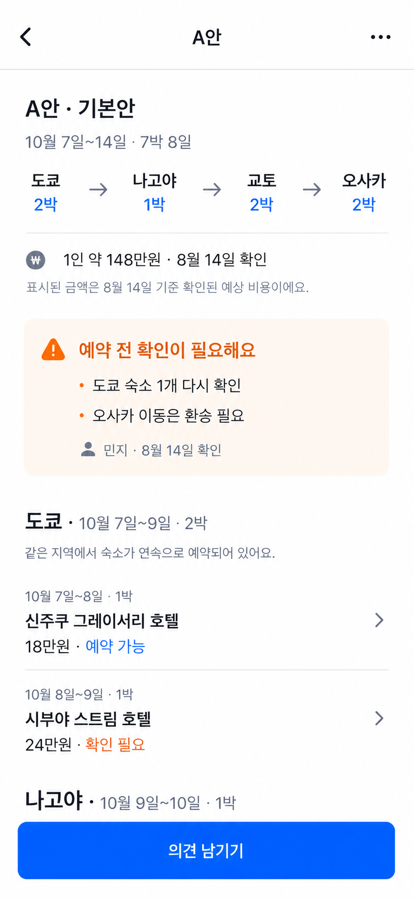

### 시각안 2

[이미지 열기](../assets/pl-02/pl-02-option-2.png)

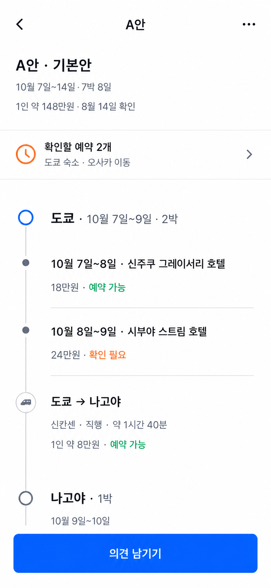

### 시각안 3

[이미지 열기](../assets/pl-02/pl-02-option-3.png)

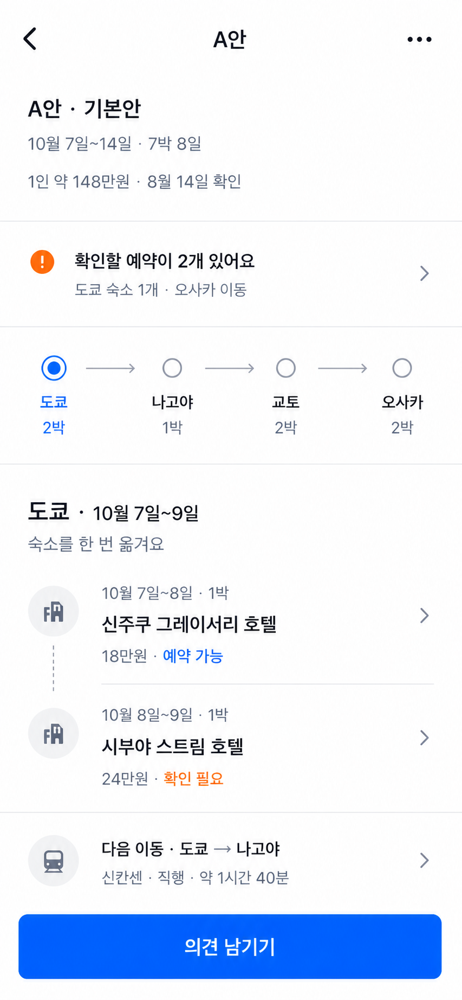

생성 이미지는 정보 계층과 탐색 방식을 선택하기 위한 시각 자료다. 실제 구현에서는 TDS 컴포넌트와 디자인 가이드의 간격·타이포그래피·아이콘을 사용한다.

`PL-01`과 `PL-02` 시안 속 `1인 약` 비용 문구는 이후 `PL-03`에서 확정한 비용 모델에 따라 실제 구현 시 `그룹 총액 · 고정 기준 인원 · 1인 예상 참고액`으로 교체한다.

## 9. `PL-03` 여행안 편집

### 화면 역할

여행안 편집은 전체 여행을 한 번에 완성하는 긴 입력 폼이 아니라, 필요한 섹션을 골라 채우는 편집 허브다. 사용자는 다음 세 가지 방식으로 같은 화면에 들어온다.

1. 여행안이 없을 때 기본안을 새로 작성한다.
2. 공개된 여행안을 복제해 달라지는 부분만 수정한다.
3. 자신이 공개한 여행안의 비공개 수정본을 작성한다.

새 기본안은 빈 섹션에서 시작하고, 복제안과 공개안 수정본은 기존 내용을 미리 채운다. 확정된 여행안은 잠기므로 편집할 수 없다.

### 진입과 내비게이션

- `PL-01`의 `첫 여행안 만들기` 또는 `새 여행안 제안하기`에서 진입한다.
- `PL-02`의 `다른 구성으로 제안하기`는 현재 여행안을 복제해 진입한다.
- 작성자는 확정 전 자신의 여행안 더보기 메뉴에서 비공개 수정본을 열 수 있다.
- 상단에는 뒤로가기, `여행안 만들기` 또는 `여행안 수정`, 자동 저장 상태를 표시한다.
- 뒤로가기는 임시안을 삭제하지 않고 이전 화면으로 돌아간다.
- 작성 중인 내용을 버리는 행동은 더보기 메뉴의 `임시안 삭제`로 분리한다.

### 임시안과 공개 원칙

- 모든 입력은 작성자 전용 임시안에 자동 저장한다.
- 임시안은 작성자에게만 `작성 중`으로 보이며, 다른 참여자에게는 존재 자체를 노출하지 않는다.
- 임시안은 여행안 수, 의견 진행률, 비교 대상에 포함하지 않는다.
- 작성자는 나갔다가 같은 임시안을 이어서 작성할 수 있다.
- 공개 여행안을 수정할 때는 마지막 공개본을 참여자에게 계속 보여주고, 작성자에게만 수정본을 보여준다.
- 공개 여행안마다 수정본은 하나만 유지하며 수정 이력을 별도로 쌓지 않는다.

### 편집 허브의 섹션

한 화면에는 세부 입력을 모두 펼치지 않고, 섹션별 완료 상태와 핵심 요약을 보여준다. 섹션을 선택하면 해당 입력 화면으로 들어간다.

| 순서 | 섹션 | 핵심 입력 | 상태 예시 |
|---|---|---|---|
| 1 | 기본 정보 | 안 이름, 제안 이유, 비용 기준 인원 | `완료`, `작성 필요` |
| 2 | 날짜와 도시 | 전체 날짜, 도시 순서, 도시별 체류일과 박수 | `도쿄 2박 → 교토 3박 → 오사카 2박` |
| 3 | 숙소 | 도시별 연속 체류 구간과 숙소 또는 미정 상태 | `4개 등록`, `확인 필요 1개` |
| 4 | 교통 | 출국·도시 간 이동·귀국 구간별 대표 정보 | `3개 등록`, `찾는 중 1개` |
| 5 | 비용 | 구간별 그룹 총액과 여행안 합계 | `480~520만원 · 가격 미정 1건` |

- 섹션 상태는 `작성 필요`, `완료`, `재확인 필요`, `변경됨`만 사용한다.
- `재확인 필요`와 `변경됨`은 해당 조건이 해소되면 사라지며 기록처럼 누적하지 않는다.
- 세부 입력 화면에서도 하단 저장 버튼을 추가하지 않고 자동 저장 후 편집 허브로 돌아온다.

### 공개 가능한 최소 조건

여행안을 공개하려면 다음 구조가 완성되어야 한다.

- 안 이름과 비용 기준 인원이 있다.
- 전체 여행 날짜가 있다.
- 도시 순서와 각 도시의 체류 구간이 전체 날짜를 빈틈이나 중복 없이 채운다.
- 도시별 박수 합계가 전체 여행의 숙박 수와 일치한다.
- 모든 숙박 구간에 실제 숙소 정보 또는 `숙소 찾는 중` 상태가 있다.
- 출국·도시 간 이동·귀국 구간에 실제 교통 정보 또는 `교통편 찾는 중` 상태가 있다.
- 일정 변경으로 충돌한 항목이 남아 있지 않다.

숙소·교통의 가격은 정확한 금액, 예상 범위 또는 정보 없음 중 하나일 수 있다. 예약 상태는 `예약 가능`, `확인 필요`, `만실`, `아직 확인 전`을 사용한다. 미정인 정보는 빈칸으로 두지 않고 상태로 명시한다.

공개 조건을 충족하지 못하면 해당 섹션에 이유를 표시한다. 하단 CTA 근처에는 가장 먼저 해결할 항목 하나와 남은 건수를 보여준다.

### 숙소와 교통 입력

#### 숙소

- 한 도시에서 숙소를 여러 번 옮길 수 있도록 날짜가 이어지는 체류 구간을 추가한다.
- 각 구간에는 이용 기간, 숙소명 또는 `숙소 찾는 중`, 예약 링크, 예약 상태, 가격을 기록한다.
- 같은 날짜가 겹치거나 도시 체류 기간 밖으로 벗어나면 공개할 수 없다.

#### 교통

- 출국, 도시 간 이동, 귀국마다 대표 교통 정보 하나를 기록한다.
- 교통수단, 출발·도착, 전체 예상 시간, 예약 링크, 예약 상태와 가격을 입력한다.
- 실제 이동에 여러 교통편이 포함돼도 MVP에서는 세부 환승편을 나누지 않고 `환승 필요`로 표시한다.

### 비용 입력과 계산

- 모든 가격의 원본 단위는 해당 구간에 필요한 그룹 전체 금액이다.
- 원화 예상액을 기본 입력으로 사용하며, 정확한 금액 또는 최솟값~최댓값 범위를 입력할 수 있다.
- 정확한 금액은 최솟값과 최댓값이 같은 범위로 계산한다.
- 여행안 총액은 가격이 있는 구간의 최솟값끼리, 최댓값끼리 각각 더한다.
- 가격이 없는 구간은 합산에서 제외하고 `가격 미정 N건`을 함께 표시한다.
- 여행안의 비용 기준 인원은 작성 시점의 참여 인원을 기본값으로 제안하되, 이후 참여자 변화에 따라 자동 변경하지 않는다.
- 1인 예상 참고액은 여행안 그룹 총액을 고정된 비용 기준 인원으로 나눠 표시한다.
- 현지 통화 원가는 `현지 통화 금액도 남기기`를 선택했을 때만 추가 입력한다.
- 실시간 환율 환산은 하지 않으며, 현지 통화 금액만 있는 항목은 원화 합계에서 제외하고 `원화 예상액 필요 N건`으로 표시한다.
- 실제 가격을 기록하면 현재 작성자와 확인 시각을 스냅샷에 함께 남긴다.

표시 예시:

- `그룹 총액 480~520만원`
- `4명 기준 · 1인 예상 120~130만원`
- `가격 미정 1건`
- `¥80,000 · 원화 예상 74~78만원`

### 복제안의 변경점

- 복제안은 원본 여행안과의 연결을 유지한다.
- 원본과 달라진 섹션에 `변경됨`을 표시한다.
- 값을 원본과 같게 되돌리면 `변경됨` 표시를 제거한다.
- 공개 전 `도쿄 +1박`, `교토 -1박`, `도쿄 숙소 변경`, `그룹 총액 +40~60만원`처럼 판단에 필요한 차이를 자동 요약한다.
- 공개 후 같은 변경 요약을 `PL-01` 카드와 `PL-04` 비교 화면에서 사용한다.
- 새 기본안에는 원본과 변경 요약이 없다.

### 일정 변경과 연결 정보 보호

- 전체 날짜, 도시 순서 또는 체류일을 바꿔도 기존 숙소·교통 정보를 즉시 삭제하지 않는다.
- 변경의 영향을 받는 현재 항목에만 `일정이 변경되어 재확인이 필요해요`를 표시한다.
- 일정에서 완전히 벗어난 항목은 작성자가 날짜를 수정하거나 제외해야 공개할 수 있다.
- 항목을 수정하거나 제외해 충돌이 해결되면 `재확인 필요`를 제거한다.
- 변경 이력, 제외 항목 보관함 또는 여러 과거 버전은 만들지 않는다.

### 공개와 수정 반영

| 작성 상태 | 하단 CTA | 결과 |
|---|---|---|
| 새 기본안 또는 복제안 | `여행안 제안하기` | 참여자에게 새 공개 여행안으로 노출 |
| 공개 여행안의 수정본 | `수정안 반영하기` | 마지막 공개본을 수정본으로 교체 |
| 공개 조건 미충족 | 비활성 CTA와 해결 항목 안내 | 임시안 유지 |

- 제안 이유는 선택 입력이며, 비어 있어도 공개할 수 있다.
- 이름이나 설명만 수정한 경우 기존 구성원 의견을 유지한다.
- 일정·도시·숙소·교통·비용·기준 인원을 수정본에 반영하면 기존 의견을 초기화하고 `여행안이 수정됐어요. 다시 의견을 남겨주세요`를 표시한다.
- 작성 중 수정본을 삭제하거나 나가도 마지막 공개본과 기존 의견은 변하지 않는다.

### 권한과 상태

- 기본안은 여행방 생성자 또는 방장이 시작한다.
- 모든 참여자는 공개 여행안을 복제해 자신의 대안을 만들 수 있다.
- 작성자만 자신의 임시안과 공개 여행안 수정본을 열고 편집하거나 삭제할 수 있다.
- 방장도 다른 참여자의 여행안을 직접 수정하지 않는다.
- 여행안 확정 후에는 모든 여행안과 임시 수정 진입을 잠근다.

### 완료 조건

- 사용자는 긴 단일 폼을 훑지 않고 필요한 섹션을 선택해 작성할 수 있다.
- 작성 중인 내용은 다른 참여자에게 노출되지 않고 나갔다 돌아와도 유지된다.
- 도시와 체류일을 바꿔도 입력한 숙소·교통 정보가 자동으로 사라지지 않는다.
- 여러 숙소, 대표 교통과 환승 여부, 미정 상태를 포함한 현실적인 여행안을 공개할 수 있다.
- 그룹 총액의 정확한 금액과 범위를 자동 합산하고 고정 인원 기준의 1인 참고액을 보여준다.
- 복제안에서 원본과 달라진 핵심 내용을 자동으로 파악할 수 있다.
- 공개 여행안 수정 중에도 다른 참여자는 마지막 공개본을 안정적으로 볼 수 있다.

## 10. `PL-03` 시각 탐색

확정된 편집 허브 명세와 `PL-01`·`PL-02`의 시각 언어를 기준으로 모바일 시안 세 개를 만들었다. 모두 작성자 전용 임시안, 압축 도시 경로, 변경 상태, 그룹 총액과 고정 `여행안 제안하기` CTA를 유지한다.

### 시각안 1

다섯 편집 섹션의 진행 상태를 하나의 목록에서 먼저 파악하는 구조다. 섹션별 색상 아이콘으로 구분을 강화했다.

[이미지 열기](../assets/pl-03/pl-03-option-1.png)

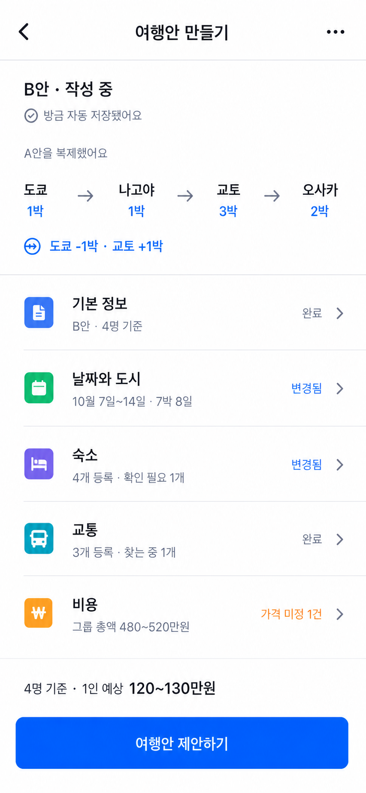

### 시각안 2 · 최종 확정

도시 경로와 체류 변경을 먼저 보여주고, 숙소·교통·기본 정보·비용을 평면적인 목록으로 이어가는 구조다. 압축 도시 경로, 회색 아이콘, 얇은 구분선, 파란 상태값과 단일 CTA가 기존 확정 시안과 가장 자연스럽게 연결된다.

[최종 확정 시안 열기](../assets/pl-03/pl-03-option-2.png)

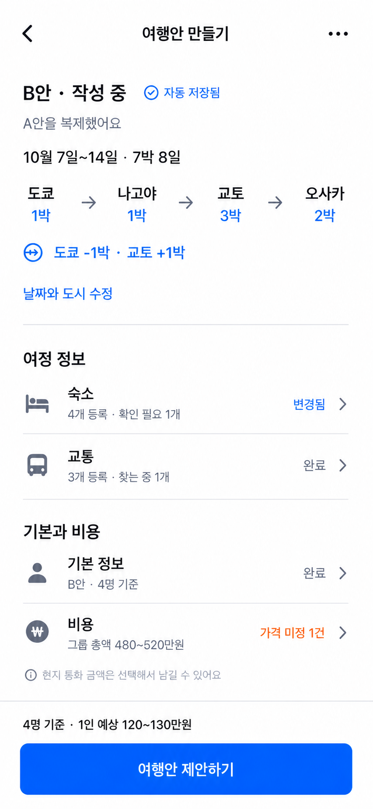

### 시각안 3

원본 여행안에서 달라진 도시·숙소·비용을 상단 요약 영역에서 먼저 확인하는 구조다. 변경점은 잘 드러나지만 큰 색상 면의 강조가 기존 화면보다 강하다.

[이미지 열기](../assets/pl-03/pl-03-option-3.png)

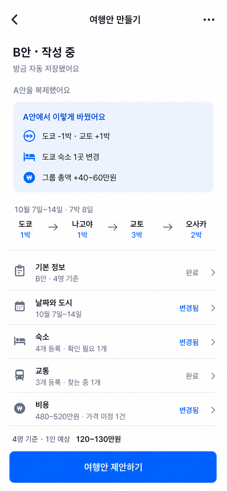

생성 이미지는 정보 계층과 시각 방향의 기준이다. 실제 구현에서는 TDS 컴포넌트와 디자인 가이드의 타이포그래피·간격·아이콘을 사용하고, 세부 입력은 각 섹션의 하위 화면에서 제공한다.

## 11. `PL-04` 여행안 비교

### 화면 역할

여행안 비교는 두 개의 공개 여행안에서 의사결정에 영향을 주는 차이를 읽고, 방장이 하나의 안을 확정하는 화면이다. 모든 참여자가 비교할 수 있지만 최종 확정은 방장만 할 수 있다.

이 화면은 모든 정보를 다시 나열하지 않는다. 차이가 있는 항목을 먼저 보여주고, 같은 내용은 접어 모바일 화면의 정보 밀도를 제한한다.

### 진입과 내비게이션

- 공개 여행안이 두 개 이상일 때 `PL-01`의 `여행안 비교하기`로 진입한다.
- 작성 중인 임시안과 공개 여행안의 비공개 수정본은 비교 대상에 포함하지 않는다.
- 상단에는 뒤로가기와 `여행안 비교` 제목을 표시한다.
- 하위 화면에서는 `계획 | 일정` 탭을 반복하지 않는다.
- 확정 후에도 `계획`의 검토 기록에서 잠긴 비교 결과를 다시 볼 수 있다.

### 비교 대상 선택

- 한 번에 두 여행안만 비교한다.
- 최초 진입 시 `PL-01` 목록 순서의 첫 두 여행안을 선택한다.
- 상단에는 현재 비교 중인 두 안만 `A안 ↔ B안` 형태로 표시한다.
- A안 또는 B안을 선택하면 바텀시트에서 해당 자리에 넣을 다른 공개 여행안을 고른다.
- 이미 반대편에서 비교 중인 안은 중복 선택할 수 없다.
- 인기순, 추천순 또는 자동 승자 선정은 사용하지 않는다.
- 여행안이 두 개뿐이면 대상 변경 행동을 표시하지 않는다.

### 비교 표현 원칙

- 화면 폭을 좌우 열로 나누지 않는다.
- 각 비교 항목 안에서 A안을 먼저, B안을 다음에 세로로 배치하고 핵심 차이를 이어서 설명한다.
- 차이가 있는 항목만 기본으로 펼친다.
- 동일한 항목은 `같은 내용 N개`로 접고 사용자가 원할 때 펼칠 수 있게 한다.
- 비교 대상을 바꾸면 차이와 동일 항목을 새 조합에 맞춰 다시 계산한다.
- 색상만으로 어느 안이 다른지 표현하지 않고 안 이름과 차이 문장을 함께 표시한다.

### 정보 배치 순서

#### 1. 날짜와 도시

- 각 안의 전체 날짜와 기간을 표시한다.
- `PL-01`~`PL-03`과 같은 압축 도시 경로로 도시 순서와 체류 박수를 보여준다.
- 도시가 5개 이상이면 각 경로를 가로로 탐색할 수 있게 하고 다음 도시 일부를 노출한다.
- 경로 아래에 `B안은 도쿄 -1박 · 교토 +1박`처럼 체류 배분 차이를 설명한다.
- 전체 날짜가 같으면 동일 항목으로 접고 도시 순서나 체류 박수의 차이를 먼저 노출한다.

#### 2. 예약 현실성

- 숙소와 교통을 모두 펼쳐 나열하지 않고 차이가 있는 구간과 위험 건수를 비교한다.
- 예: `A안 · 숙소 확인 필요 1건`, `B안 · 모든 숙소 예약 가능`.
- `만실`, `확인 필요`, `아직 확인 전`, `숙소 찾는 중`, `교통편 찾는 중`, `환승 필요`를 판단 차이로 표시한다.
- 구체적인 숙소명·교통 정보가 필요하면 해당 안의 `PL-02` 상세로 이동한다.
- 가격과 예약 상태가 스냅샷임을 알 수 있도록 최근 확인 시각을 함께 표시한다.

#### 3. 비용

- 각 안의 원화 기준 그룹 총액 범위를 그대로 표시한다.
- 비용 기준 인원과 1인 예상 참고액을 함께 보여준다.
- 범위가 겹치면 `예상 범위가 겹쳐요`라고 설명하고 어느 안이 더 저렴하다고 단정하지 않는다.
- 두 범위가 완전히 분리된 경우에만 `B안이 최소 50만원 높아요`처럼 확실한 최소 차이를 표시한다.
- 가격 미정 항목이 있으면 `정확한 비교가 어려워요 · 가격 미정 N건`을 표시한다.
- 범위의 중간값이나 `-20~+80만원` 같은 차이 범위는 새로 계산해 보여주지 않는다.

#### 4. 구성원 의견

- 각 안의 `좋아요`, `괜찮아요`, `어려워요`, `의견 전` 인원수를 기본으로 표시한다.
- 종합 점수, 승률, 인기 순위 또는 자동 추천은 만들지 않는다.
- `구성원별 보기`를 펼치면 이름과 선택을 보여준다.
- `어려워요`의 구체적인 사유는 의견 작성자 본인과 방장에게만 노출한다.
- 안 이름과 의견 집계는 동일하더라도 접지 않고 항상 표시한다.

### 사용자별 행동

#### 참여자

- 두 여행안의 차이와 의견 집계를 볼 수 있다.
- 비교 대상을 바꿀 수 있다.
- 여행안을 확정하거나 확정 대상으로 미리 선택할 수 없다.
- 비교 화면에는 별도의 의견 CTA를 두지 않으며, 의견 변경은 각 안의 `PL-02`에서 한다.

#### 방장

- 참여자와 같은 비교 정보를 본다.
- `어려워요`의 사유와 의견을 남기지 않은 구성원을 확인할 수 있다.
- 화면 하단의 단일 `여행안 확정하기` CTA를 사용할 수 있다.
- 비교 화면 자체에서는 A안이나 B안을 확정 대상으로 선택하지 않는다.

### 확정 바텀시트

방장이 `여행안 확정하기`를 선택하면 TDS 바텀시트를 연다.

1. 제목 `어떤 안으로 확정할까요?`와 현재 비교 중인 A안·B안을 단일 선택 목록으로 보여준다.
2. 안을 선택하면 날짜, 도시 경로와 그룹 총액을 짧게 요약한다.
3. 선택한 안의 불완전한 정보를 숨기지 않고 건수로 표시한다.

표시 예시:

- `숙소 찾는 중 1건`
- `예약 확인 필요 2건`
- `만실 1건`
- `가격 미정 1건`
- `의견 전 1명 · 어려워요 1명`

- 불완전한 숙소·교통·가격이나 미응답 의견이 있어도 확정을 막지 않는다.
- 모든 구성원의 응답, 다수결, 만장일치 또는 투표 마감을 확정 조건으로 두지 않는다.
- 선택 전에는 최종 버튼을 비활성화하고, 선택 후 `B안으로 확정하기`처럼 대상이 명확한 버튼을 제공한다.
- 바텀시트를 닫거나 뒤로가면 아무 상태도 바꾸지 않는다.
- 최종 버튼을 선택하면 추가 확인 화면 없이 확정한다.

### 확정 결과와 이동

- 선택한 공개 여행안을 복사해 별도의 확정 일정을 생성한다.
- `찾는 중`, `확인 필요`, `만실`, `가격 미정` 상태도 일정에 그대로 전달한다.
- 선택된 안, 다른 안과 당시 구성원 의견은 계획의 검토 기록으로 잠근다.
- 확정 후 여행안 수정·삭제, 의견 변경, 대안 복제와 확정 취소를 제공하지 않는다.
- 숙소·교통·날짜의 이후 변경은 원본 여행안을 다시 열지 않고 `일정` 기능에서 다룬다.
- 확정이 끝나면 별도 완료 화면 없이 `일정` 탭으로 이동한다.
- 일정 상단에 `B안으로 일정을 확정했어요`를 표시하고, 불완전한 항목이 있으면 `확인할 내용이 3개 있어요`를 함께 보여준다.

### 상태별 예외

- 비교 중 한 여행안이 작성자에 의해 삭제되면 남은 안과 다음 목록 순서의 안을 비교한다. 대체할 안이 없으면 `PL-01`로 돌아간다.
- 공개 여행안 수정본이 반영돼 의견이 초기화되면 비교 화면에도 즉시 `의견 전` 상태를 반영한다.
- 방장이 아닌 사용자가 비교 중 방장이 일정을 확정하면 비교를 잠그고 `확정 일정 보기`로 전환한다.

### 완료 조건

- 사용자는 한 번에 두 안만 비교하고 필요할 때 비교 대상을 바꿀 수 있다.
- 좌우로 좁은 열을 만들지 않고 날짜·도시·예약·비용·의견 차이를 읽을 수 있다.
- 동일한 내용은 접혀 있고 의사결정에 영향을 주는 차이가 먼저 보인다.
- 비용 범위와 가격 미정 상태를 실제보다 확정적으로 표현하지 않는다.
- 참여자에게 확정 행동이 노출되지 않고 방장에게만 단일 CTA가 보인다.
- 방장은 불완전한 정보와 미응답 의견을 확인한 뒤에도 하나의 안을 확정할 수 있다.
- 확정 뒤 계획 기록은 잠기고 사용자는 바로 별도의 일정으로 이동한다.

## 12. `PL-04` 시각 탐색

확정된 비교 명세와 `PL-01`~`PL-03`의 시각 언어를 기준으로 모바일 시안 세 개를 만들었다. 모두 두 안을 세로로 비교하고, 차이가 있는 항목을 먼저 펼치며, 방장에게만 고정 `여행안 확정하기` CTA를 제공한다.

### 시각안 1 · 최종 확정

두 안의 핵심 차이를 상단에서 먼저 요약한 뒤 날짜와 도시, 예약, 비용, 구성원 의견을 평면적인 목록으로 이어가는 구조다. 압축 도시 경로, 얇은 구분선, 제한된 파란색·주황색과 단일 CTA가 기존 확정 시안과 가장 자연스럽게 연결된다.

[최종 확정 시안 열기](../assets/pl-04/pl-04-option-1.png)

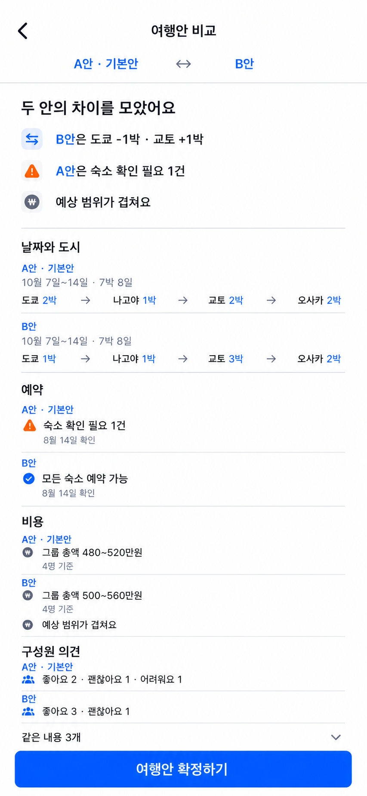

시안은 전체 정보 구조를 한 이미지에 보여준다. 실제 구현에서는 본문을 세로로 스크롤하고 하단 CTA를 고정하며, 모든 내용을 한 화면에 맞추기 위해 글자와 간격을 축소하지 않는다.

### 시각안 2

날짜와 도시, 예약, 비용, 의견을 기준별로 나누고 각 기준 안에서 A안과 B안을 순서대로 읽는 구조다.

[이미지 열기](../assets/pl-04/pl-04-option-2.png)

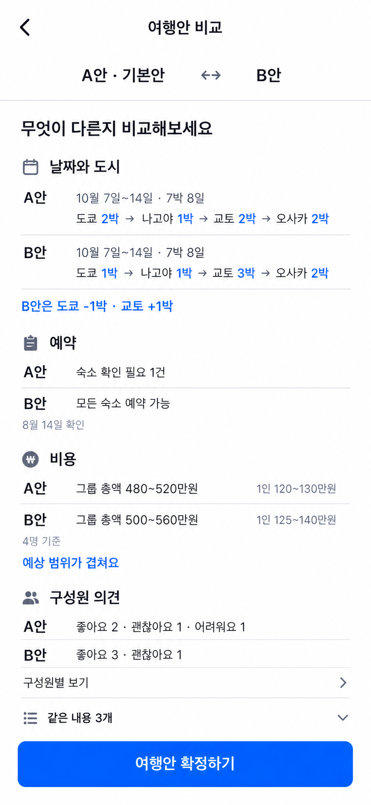

### 시각안 3

확정 전에 확인할 차이를 먼저 강조하고 그 아래에서 비교 근거를 검증하는 구조다.

[이미지 열기](../assets/pl-04/pl-04-option-3.png)

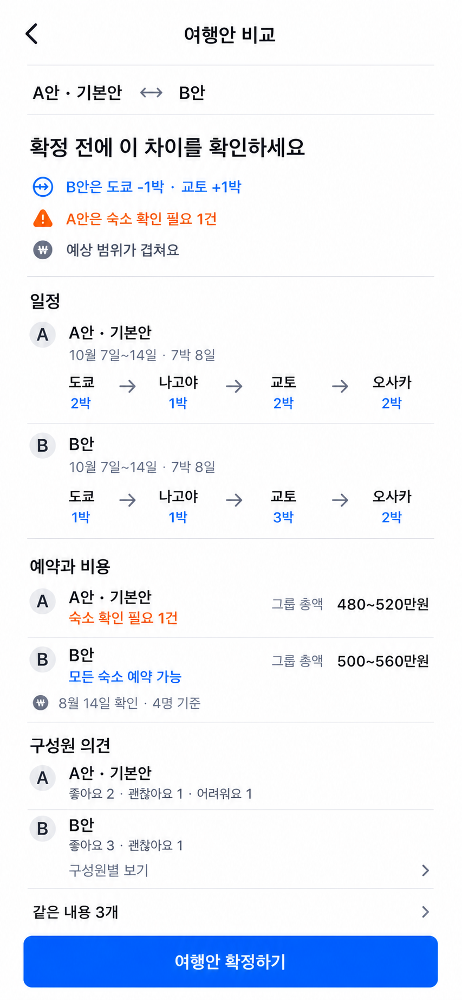

생성 이미지는 정보 계층과 시각 방향의 기준이다. 실제 구현에서는 TDS 컴포넌트와 디자인 가이드의 타이포그래피·간격·아이콘을 사용한다.

## 13. `IT-01` 일정 탭 홈

### 화면 역할

일정 탭 홈은 방장이 확정한 여행안을 실제 여행 전과 여행 중에 함께 사용하는 공동 일정이다. 사용자는 다음 세 가지를 바로 이해해야 한다.

1. 여행 전체 날짜와 도시 흐름이 무엇인지
2. 아직 확인하거나 수정해야 할 숙소·교통 정보가 무엇인지
3. 각 날짜에 어느 도시에 있고 어떤 숙소와 교통을 이용하는지

계획에서 비교했던 비용과 구성원 의견은 이 화면에서 반복하지 않는다. 확정 당시 판단 근거는 잠긴 `계획` 기록에서 확인하고, 일정은 확정 이후의 최신 여행 정보를 제공한다.

### 진입과 내비게이션

- 여행안 확정 후 여행방의 기본 탭은 `일정`이다.
- 방장이 `PL-04`에서 최종 확정하면 별도 완료 화면 없이 이 화면으로 이동한다.
- 상단에는 뒤로가기, 여행방 이름과 방장용 더보기 메뉴를 표시한다.
- 여행방 안의 `계획 | 일정` 탭을 유지하고 `일정`을 선택 상태로 표시한다.
- 일정 홈에는 고정 하단 CTA를 두지 않는다.
- 숙소·교통 상세 바텀시트를 닫으면 보던 날짜의 스크롤 위치를 유지한다.

### 확정 전 빈 화면

여행안이 확정되기 전에도 `일정` 탭은 노출한다. 선택하면 임시 일정이나 기본안을 미리 보여주지 않고 다음 내용만 표시한다.

- 제목: `여행안이 확정되면 일정을 볼 수 있어요`
- 설명: `계획에서 여행안을 비교하고 확정해 주세요`
- 단일 행동: `계획 보러 가기`

확정 전 별도의 임시 일정 작성 기능은 제공하지 않는다.

### 정보 배치 순서

#### 1. 여행 요약

- 전체 날짜와 기간: `10월 7일~14일 · 7박 8일`
- 압축 도시 경로: `도쿄 2박 → 나고야 1박 → 교토 2박 → 오사카 2박`
- 도시가 5개 이상이면 기존 계획 화면과 같이 가로로 탐색하고 다음 도시 일부를 노출한다.
- 그룹 비용, 비용 기준 인원과 구성원 의견은 표시하지 않는다.

#### 2. 미확인 변경

참여자가 아직 확인하지 않은 일정 변경이 있을 때만 `일정 2개가 변경됐어요` 배너를 표시한다.

- 배너는 단순히 화면을 열었다고 사라지지 않는다.
- 선택하면 변경 항목, 이전 내용, 변경 후 내용, 변경자와 변경 시각을 보여준다.
- 사용자가 `변경 내용 확인했어요`를 선택하면 현재 쌓인 미확인 변경을 한 번에 확인 처리한다.
- 확인 여부는 참여자별로 관리하며 다른 참여자의 상태에 영향을 주지 않는다.
- 새 변경이 생기면 새로 확인하지 않은 내용만 배너에 다시 포함한다.
- 확인한 과거 변경은 더보기 메뉴의 `변경 내역`에서 조회한다.

#### 3. 확인할 내용

확정된 일정에 불완전하거나 일정과 맞지 않는 정보가 있을 때만 `확인할 내용 N개`를 표시한다.

- `숙소 찾는 중`, `교통편 찾는 중`, `확인 필요`, `만실`, `가격 미정`, `일정 확인 필요` 상태를 일정 데이터에서 자동으로 수집한다.
- 사용자가 수동으로 완료 처리하는 별도 체크리스트를 만들지 않는다.
- 항목을 선택하면 관련 숙소·교통 상세 바텀시트를 연다.
- 방장이 정보를 보완해 문제가 해결되면 목록과 건수에서 자동으로 제거한다.

#### 4. 날짜별 일정

- 전체 여행을 날짜 순서의 하나의 세로 목록으로 보여준다.
- 출발 전에는 첫날부터 표시한다.
- 여행 중에는 오늘 날짜를 강조하고 해당 날짜 위치로 진입한다.
- 가로 날짜 선택기와 달력 화면은 제공하지 않는다.
- 각 날짜에는 현재 도시, 그날 묵는 숙소, 그날 이용하는 교통과 선택 메모를 표시한다.
- 같은 숙소를 여러 날 이용해도 각 날짜에서 숙소를 한 줄로 확인할 수 있게 한다.
- 교통은 실제 이동하는 날짜에만 표시한다.

표시 예시:

| 정보 | 예시 |
|---|---|
| 날짜와 도시 | `10월 8일 · 도쿄` |
| 숙소 | `신주쿠 그레이서리 호텔 · 2일째` |
| 교통 | `09:00 도쿄 → 나고야 · 기차` |
| 메모 | `저녁에는 신주쿠 근처에서 식사` |

### 날짜별 항목의 정보 밀도

- 숙소는 이름과 그날의 숙박·확인 상태를 한두 줄로 표시한다.
- 교통은 출발 시각, 출발지·도착지와 확인 상태를 한두 줄로 표시한다.
- 메모는 날짜마다 하나의 선택 입력으로 두고 최대 두 줄까지 미리 보여준다.
- 메모에는 장소, 간단한 계획과 전달사항을 자유롭게 적을 수 있다.
- 메모에는 체크박스, 완료 상태, 담당자와 마감일을 만들지 않는다.
- 가격, 주소, 예약 링크와 전체 확인 정보는 숙소·교통 상세에서 보여준다.
- 정상 상태와 확인 필요 상태를 색상만으로 구분하지 않고 텍스트를 함께 표시한다.

### 숙소·교통 상세 바텀시트

- 일정 홈에서 숙소나 교통을 선택하면 TDS 바텀시트를 연다.
- 숙소에는 이름, 이용 기간, 주소, 예약 상태, 가격, 확인 정보와 예약 링크를 표시한다.
- 교통에는 이동 구간, 출발·도착 시각, 교통수단, 환승 여부, 예약 상태, 가격, 확인 정보와 예약 링크를 표시한다.
- 참여자는 상세 조회와 외부 예약 정보 이동만 할 수 있다.
- 방장에게만 하단 `수정하기`를 표시한다.
- `수정하기`를 선택하면 입력이 많은 별도 편집 화면으로 이동한다.

### 수정 권한과 반영

- 확정 일정은 방장만 수정할 수 있다.
- 참여자는 일정과 상세를 조회할 수 있지만 수정 행동을 볼 수 없다.
- 방장은 날짜, 도시, 숙소, 교통과 날짜별 메모를 모두 수정할 수 있다.
- 숙소·교통은 항목 상세 바텀시트의 `수정하기`에서 편집 화면으로 이동한다.
- 날짜·도시는 상단 더보기 메뉴의 `여행 일정 변경`에서 수정한다.
- 전체 편집 모드와 목록의 인라인 편집은 제공하지 않는다.
- 항목별 저장이 끝나면 임시 공개 절차 없이 모든 참여자에게 즉시 반영한다.
- 확정 전 여행안과 당시 의견 기록은 잠긴 상태로 유지하며 일정 수정으로 변경하지 않는다.

### 날짜·도시 변경과 연결 정보 보호

- 날짜, 도시 순서 또는 체류일을 변경하면 저장 전에 영향받는 숙소·교통 건수를 안내한다.
- 기존 숙소·교통의 날짜를 자동으로 이동하거나 정보를 삭제하지 않는다.
- 변경된 일정과 맞지 않는 항목은 `일정 확인 필요`로 전환한다.
- 해당 항목은 상단 `확인할 내용`에 자동으로 포함한다.
- 방장이 상세에서 날짜와 내용을 수정해 충돌을 해결하면 `일정 확인 필요`를 제거한다.

### 변경 알림과 이력

- 모든 변경은 앱 내부 변경 이력에 기록한다.
- 날짜·도시 변경, 숙소·교통 교체 또는 취소처럼 중요한 변경만 토스 메시지 알림 후보로 둔다.
- 메모, 링크, 가격 확인 시각 같은 작은 변경은 외부 메시지를 보내지 않는다.
- 방장이 여러 항목을 연속으로 수정하면 가능한 한 하나의 알림으로 묶는다.
- 토스 메시지는 사용자 권한과 문구 심사를 충족한 경우에만 발송한다.
- 변경 이력은 무엇이, 언제, 누구에 의해 바뀌었는지 확인할 수 있게 한다.

### 상태별 화면

#### 확정 직후

- `B안으로 일정을 확정했어요`를 표시한다.
- 불완전한 항목이 있으면 `확인할 내용이 3개 있어요`를 함께 보여준다.
- 완료 화면을 추가하지 않고 일정 내용을 바로 사용할 수 있게 한다.

#### 확인할 내용이 없을 때

- 빈 확인 영역이나 `모두 완료` 카드를 남기지 않는다.
- 여행 요약 다음에 날짜별 일정을 바로 이어서 보여준다.

#### 변경이 없거나 모두 확인했을 때

- 미확인 변경 배너를 표시하지 않는다.
- 과거 변경은 더보기의 `변경 내역`에서만 확인한다.

### 완료 조건

- 사용자는 여행 전체 날짜와 도시 흐름을 먼저 이해할 수 있다.
- 사용자는 별도 날짜 선택기 없이 세로 스크롤로 전체 일정을 탐색할 수 있다.
- 사용자는 각 날짜에서 현재 도시, 숙소와 이동 정보를 한두 줄로 확인할 수 있다.
- 불완전한 정보는 별도 할 일 없이 일정 상태에서 자동으로 수집되고 해결되면 사라진다.
- 참여자는 숙소·교통의 전체 정보를 바텀시트에서 빠르게 확인할 수 있다.
- 방장만 필요한 항목의 편집 화면에 진입하고 저장 결과를 즉시 공유할 수 있다.
- 날짜·도시를 바꿔도 기존 숙소·교통 정보가 자동으로 사라지지 않는다.
- 참여자는 변경 내용을 명시적으로 확인하기 전까지 미확인 변경 안내를 계속 볼 수 있다.
- 일정 홈은 비용·의견·고정 CTA를 반복하지 않고 여행 중 사용할 정보에 집중한다.

## 14. `IT-01` 시각 탐색

확정된 일정 탭 홈 명세와 `PL-01`~`PL-04`의 시각 언어를 기준으로 모바일 시안 세 개를 만들었다. 모두 여행 요약, 자동 생성된 `확인할 내용`, 날짜별 세로 일정, 숙소·교통·메모의 간결한 요약을 유지하며 고정 하단 CTA를 두지 않는다.

### 시각안 1

날짜와 도시를 큰 섹션 제목으로 두고 교통, 숙소와 메모를 평면적인 행으로 이어가는 구조다. 기존 화면의 큰 제목과 얇은 구분선 문법을 가장 직접적으로 사용한다.

[이미지 열기](../assets/it-01/it-01-option-1.png)

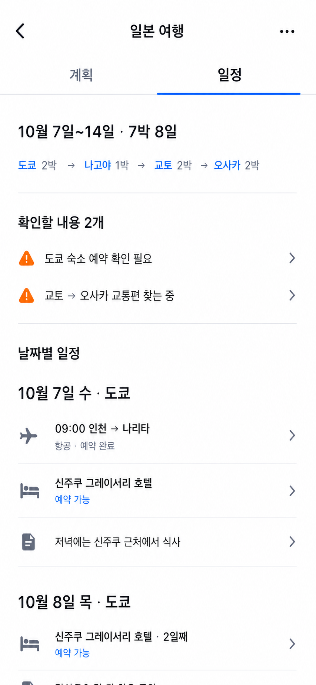

### 시각안 2 · 최종 확정

**최종 확정안.** 날짜를 잇는 절제된 세로 여정 레일로 7~10일 여행의 연속성을 강조한다. 확인할 내용은 하나의 옅은 주황색 영역으로 묶고, 날짜마다 현재 도시·숙소·교통·메모를 같은 흐름 안에서 빠르게 확인할 수 있게 한다.

[최종 확정 시안 열기](../assets/it-01/it-01-option-2.png)

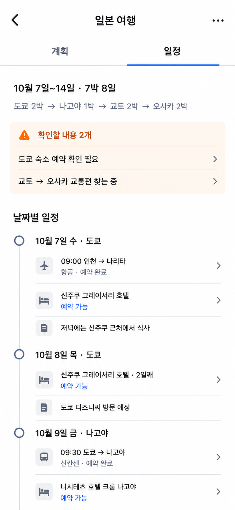

### 시각안 3

날짜별 숙소·교통·메모를 더 압축된 평면 목록으로 보여줘 한 화면에서 여러 날짜를 빠르게 훑는 구조다.

[이미지 열기](../assets/it-01/it-01-option-3.png)

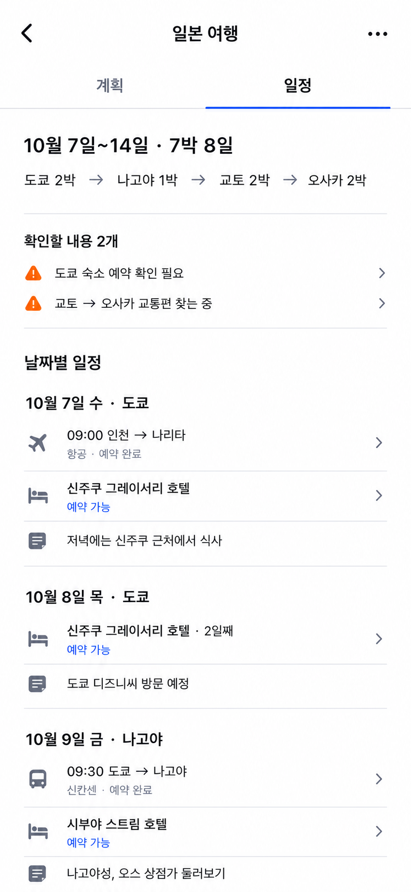

생성 이미지는 정보 계층과 날짜 탐색 표현을 선택하기 위한 시각 자료다. 실제 구현에서는 TDS 컴포넌트와 디자인 가이드의 타이포그래피·간격·아이콘을 사용한다.

## 15. `TR-01` 여행 목록

### 화면 역할

여행 목록은 사용자가 참여 중인 여행을 찾아 다시 들어가거나 새 여행을 시작하는 앱의 루트 화면이다. 사용자는 다음 세 가지를 바로 이해해야 한다.

1. 지금 진행 중인 여행이 무엇인지
2. 각 여행에서 내가 확인하거나 해야 할 일이 있는지
3. 새 여행을 어디서 만들 수 있는지

이 화면은 여러 여행안이나 날짜별 일정을 펼쳐 보여주는 대시보드가 아니다. 여행방마다 현재 상태와 다음 맥락 하나만 보여주고, 구체적인 계획과 일정은 여행방 안에서 확인한다.

### 진입과 내비게이션

- 앱을 일반 경로로 열고 토스 로그인이 완료되면 이 화면으로 진입한다.
- 초대 링크로 들어온 사용자는 여행 목록을 거치지 않고 `IN-01 초대장`으로 바로 이동한다.
- 초대 참여가 끝나면 해당 여행방으로 이동하고, 이후 일반 진입부터 여행 목록에 표시한다.
- 앱의 루트 화면이므로 상단 제목은 `내 여행`으로 표시하고 여행방 내부의 `계획 | 일정` 탭을 노출하지 않는다.
- 앱 전체 하단 탭바, 검색과 필터는 제공하지 않는다.
- 로그인 상태가 만료되면 토스 로그인 완료 후 같은 화면으로 돌아온다.

### 정보 배치 순서

#### 1. 상단 내비게이션

- 제목: `내 여행`
- 별도의 뒤로가기와 전역 메뉴를 추가하지 않는다.
- 설정·프로필·알림함처럼 여행 목록의 핵심 목적과 무관한 전역 기능은 MVP에 만들지 않는다.

#### 2. 진행 중인 여행

계획 중이거나 일정이 확정된 출발 전·여행 중 여행을 `진행 중인 여행`에 표시한다.

- 현재 날짜가 여행 기간 안에 있는 여행을 맨 위에 둔다.
- 나머지는 최근 활동 순으로 정렬한다.
- 수동 정렬, 즐겨찾기와 고정 기능은 제공하지 않는다.
- 전체 날짜가 아직 없으면 종료된 여행으로 분류하지 않고 `일정 미정`으로 표시한다.

#### 3. 지난 여행

- 종료일이 지난 여행은 `지난 여행`에 표시한다.
- 최근 종료된 여행부터 정렬한다.
- 지난 여행도 삭제하거나 자동 보관하지 않고 계획 기록과 확정 일정을 계속 볼 수 있게 한다.
- 후기, 정산, 사진과 기념 기능은 노출하지 않는다.
- 지난 여행이 없으면 섹션 자체를 표시하지 않는다.

#### 4. 하단 핵심 행동

- 로그인한 모든 사용자는 고정 TDS `BottomCTA.Single`의 `새 여행 만들기`를 사용할 수 있다.
- 여행이 없는 빈 화면에서도 같은 CTA를 유지하며 본문에 중복 생성 버튼을 추가하지 않는다.
- 선택하면 `TR-02 여행방 만들기`로 이동한다.

### 여행 항목의 정보

여행 하나는 큰 홍보 카드가 아니라 목록에서 빠르게 구분할 수 있는 평면적인 항목으로 표시한다.

| 우선순위 | 정보 | 예시 |
|---|---|---|
| 1 | 여행 이름 | `일본 여행` |
| 2 | 현재 상태 | `계획 중`, `일정 확정`, `여행 중`, `여행 완료` |
| 3 | 전체 날짜 | `10월 7일~14일 · 7박 8일`, `일정 미정` |
| 4 | 도시 요약 | `도쿄 · 나고야 · 교토 · 오사카` |
| 5 | 참여 인원 | `4명` |
| 6 | 사용자별 다음 맥락 | `내 의견을 기다리는 여행안 2개`, `일정 2개가 변경됐어요` |

- 도시별 체류 박수와 숙소·교통 상세는 목록에서 반복하지 않는다.
- 도시가 많으면 앞에서부터 표시하고 `외 2곳`처럼 한 줄 안에서 줄인다.
- 여행 이름이 같아도 날짜와 도시 정보로 구분할 수 있게 한다.
- 상태는 색상만으로 표현하지 않고 텍스트를 함께 표시한다.
- 참여자 얼굴 목록과 여행 사진은 MVP에 표시하지 않는다.

### 사용자별 다음 맥락

여행 항목에는 여러 상태를 쌓지 않고 사용자에게 가장 중요한 안내 하나만 표시한다.

우선순위는 다음과 같다.

1. 아직 확인하지 않은 일정 변경
2. 아직 의견을 남기지 않은 여행안
3. 방장이 해야 하는 첫 여행안 작성 또는 여행안 비교
4. 확정 일정의 `확인할 내용`
5. 별도 행동이 없을 때 현재 진행 상태

- 참여자가 해결할 수 없는 방장용 편집 행동은 참여자에게 안내하지 않는다.
- 안내를 선택하면 관련 여행방의 `PL-01` 또는 `IT-01`로 이동하고 필요한 항목이 보이는 위치를 연다.
- 알림 개수, 진행률과 상태 배지를 동시에 쌓지 않는다.

### 여행 선택 후 이동

| 여행 상태 | 기본 진입 화면 |
|---|---|
| 여행안 확정 전 | `PL-01 계획 탭 홈` |
| 여행안 확정 후·출발 전 | `IT-01 일정 탭 홈` |
| 여행 중 | `IT-01`의 오늘 날짜 위치 |
| 여행 완료 | `IT-01 일정 탭 홈` |

- 확정 후에도 사용자는 여행방 안의 `계획` 탭에서 잠긴 검토 기록을 볼 수 있다.
- 여행의 기본 정보 영역을 선택하면 상태에 맞는 기본 화면으로 이동한다.
- 강조된 `다음 맥락` 영역을 선택하면 같은 여행방의 관련 항목이 보이는 위치로 바로 이동한다.
- 한 여행에 `다음 맥락`은 하나만 표시하고, 그 안에 여러 버튼을 넣지 않는다.

### 빈 화면

참여 중인 여행이 하나도 없으면 목록 대신 다음 내용을 보여준다.

- 제목: `아직 참여 중인 여행이 없어요`
- 설명: `새 여행을 만들거나 친구의 초대를 받아보세요`
- 하단 핵심 행동: `새 여행 만들기`

- 초대 코드 입력이나 초대 검색 기능은 제공하지 않는다. 초대 참여는 공유 링크로만 시작한다.
- 빈 화면을 여행 추천이나 예시 콘텐츠로 채우지 않는다.

### 로딩과 오류

- 최초 로딩에는 실제 여행 항목과 비슷한 높이의 단순 스켈레톤을 사용한다.
- 최초 불러오기에 실패하면 `여행을 불러오지 못했어요`와 `다시 시도`를 표시한다.
- 이미 목록이 보이는 상태에서 새로고침이 실패하면 기존 목록을 유지하고 짧은 오류 안내만 표시한다.
- 중복 요청으로 같은 여행을 여러 번 표시하지 않는다.

### 권한과 목록 반영

- 사용자가 정상적으로 참여한 여행방만 목록에 표시한다.
- 초대 링크를 열었지만 참여를 완료하지 않은 여행은 목록에 추가하지 않는다.
- 다른 사용자의 여행방을 추측 가능한 식별자로 조회할 수 없게 한다.
- 새 여행 생성이나 초대 참여가 완료되면 목록에 즉시 반영한다.
- 여행방 나가기와 삭제는 여행 항목의 빠른 행동으로 제공하지 않고 여행방 설정의 별도 정책으로 남긴다.

### MVP에서 제공하지 않는 기능

- 여행 검색, 필터와 사용자 정렬
- 즐겨찾기, 고정과 수동 보관
- 여행 사진이나 커버 이미지 설정
- 참여자 아바타 목록
- 초대 코드 직접 입력
- 지난 여행의 후기·정산·사진·기념 기능

### 완료 조건

- 사용자는 앱을 열었을 때 진행 중인 여행과 지난 여행을 구분할 수 있다.
- 사용자는 각 여행의 날짜, 도시, 상태와 자신에게 필요한 다음 맥락 하나를 이해할 수 있다.
- 사용자는 여행 항목을 선택해 상태에 맞는 계획 또는 일정 화면으로 들어갈 수 있다.
- 사용자는 어떤 목록 상태에서도 하나의 `새 여행 만들기` 행동을 찾을 수 있다.
- 초대 참여를 완료하지 않았거나 권한이 없는 여행은 목록에 노출되지 않는다.
- 빈 화면, 최초 로딩 실패와 새로고침 실패에서 다음 행동을 알 수 있다.
- 화면은 검색·필터·사진·다중 버튼 없이 여행을 찾고 시작하는 목적에 집중한다.

## 16. TR-01 시각 탐색과 최종안

TR-01 명세를 같은 정보와 상태로 유지하고, 목록에서 무엇을 먼저 읽게 할지만 세 방향으로 비교한다.

### 시안 1 · 상태 메시지 선두형

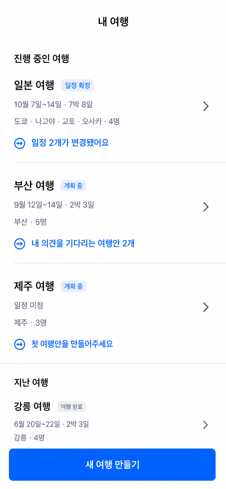

- 각 여행에서 사용자가 지금 확인하거나 해야 할 내용을 파란색 한 줄로 가장 먼저 인지하게 한다.
- 기존 PL·IT 화면의 아이콘과 상태 색상 문법을 가장 직접적으로 이어간다.

### 시안 2 · 날짜 중심형

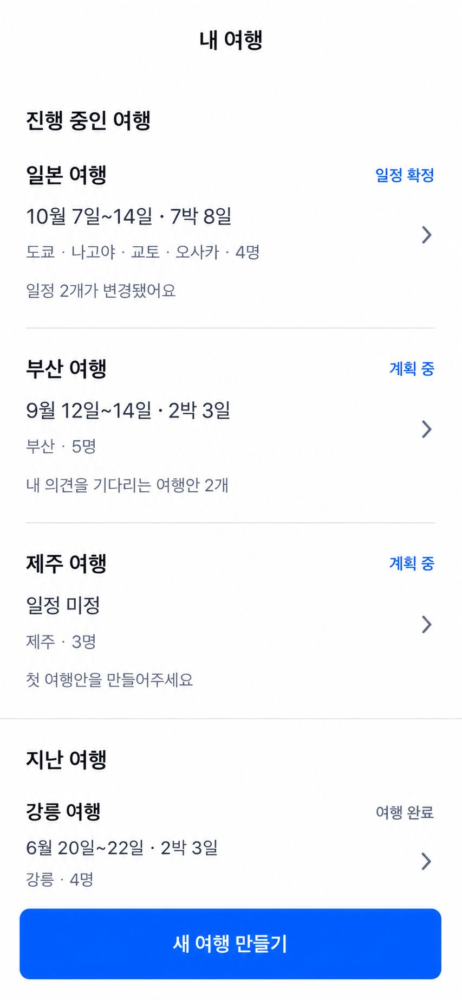

- 날짜와 여행 기간을 크게 보여 여러 여행을 일정 기준으로 빠르게 훑게 한다.
- 다음 맥락은 보조 문장으로 낮춰 목록 밀도를 가장 단순하게 유지한다.

### 시안 3 · 다음 행동 중심형 — 최종 확정

- 여행별 다음 맥락을 옅은 파란 면으로 묶어 행동 지점을 분명히 한다.
- 강조 면 전체를 하나의 맥락 진입점으로 사용하고 내부에 세부 버튼을 추가하지 않는다.

최종안은 시안 3으로 확정한다.

- 옅은 파란 면은 사용자에게 가장 중요한 `다음 맥락` 하나를 강조한다.
- 기본 정보 영역은 여행의 기본 화면으로, 강조 면은 관련 항목으로 바로 이동한다.
- 행동이 없으면 강조 면을 만들지 않고 기본 정보만 표시한다.
- 카드, 배지와 안내를 추가로 쌓지 않아 목록의 평면성과 간결함을 유지한다.

## 17. `TR-02` 여행방 만들기

### 화면 역할

`TR-02`는 협업을 시작할 여행방의 이름만 정하는 짧은 생성 화면이다. 날짜, 도시, 숙소, 교통과 비용은 여행방을 만든 뒤 `PL-03`의 첫 여행안에서 입력한다. 여행방 생성과 여행안 작성을 한 화면에 합쳐 첫 진입부터 긴 양식을 만들지 않는다.

### 진입과 내비게이션

- `TR-01`의 고정 CTA `새 여행 만들기`에서 진입한다.
- 로그인한 사용자만 진입할 수 있다.
- 상단에는 뒤로가기와 제목 `새 여행 만들기`만 표시한다.
- 뒤로가면 서버에 여행방이나 임시 데이터를 만들지 않고 `TR-01`로 돌아간다.
- 입력 항목이 여행 이름 하나이므로 이탈 확인 팝업과 자동 저장은 제공하지 않는다.

### 정보 배치

위에서 아래 순서로 다음 내용을 표시한다.

1. 안내 제목: `어떤 여행을 계획하고 있나요?`
2. 안내 문장: `먼저 여행 이름만 정해주세요. 날짜와 도시는 여행안을 만들며 정할 수 있어요.`
3. 입력 항목: `여행 이름`
4. 예시 문구: `예: 일본 여행`
5. 고정 하단 CTA: `여행 만들기`

- 여행 이름 외의 설명, 커버 이미지, 날짜, 목적지와 참여자 입력은 두지 않는다.
- 입력 중 키보드가 열리면 CTA는 키보드 위에서 계속 확인할 수 있게 한다.
- 입력란에 처음 진입하면 자동으로 포커스하되 임의의 기본 이름은 채우지 않는다.

### 여행 이름 규칙

- 앞뒤 공백을 제외한 1자 이상을 필수로 한다.
- 최대 30자로 제한하고 제한에 가까워졌을 때만 글자 수를 보여준다.
- 한글, 영문, 숫자, 공백과 이모지를 허용한다.
- 같은 사용자의 기존 여행과 이름이 같아도 생성할 수 있다. 목록에서는 날짜와 도시로 구분한다.
- 공백만 있으면 CTA를 활성화하지 않는다.
- 유효한 이름을 입력하기 전까지 `여행 만들기` CTA는 비활성화한다.

### 생성 결과와 이동

`여행 만들기`를 선택하면 다음 작업을 한 번의 생성으로 처리한다.

1. 여행방을 만든다.
2. 생성자를 방장 겸 첫 참여자로 등록한다.
3. 여행방을 `계획 중` 상태로 `TR-01` 목록에 반영한다.
4. 빈 여행안을 자동으로 만들지 않고 `PL-01`의 여행안 없음 상태로 이동한다.

- 별도 완료 화면, 성공 팝업과 축하 애니메이션은 표시하지 않는다.
- `PL-01`의 핵심 행동 `첫 여행안 만들기`를 통해 `PL-03`으로 이어진다.
- 첫 여행안을 공개하기 전에는 초대 공유 행동을 노출하지 않는다.
- 성공 후 뒤로가기는 생성 폼이 아니라 `TR-01`로 이동하게 한다.

### 로딩과 오류

- 생성 요청 중에는 CTA를 로딩 상태로 바꾸고 중복 선택을 막는다.
- 생성에 실패하면 입력한 이름을 유지하고 `여행을 만들지 못했어요. 다시 시도해주세요`를 보여준다.
- 재시도는 같은 입력값을 사용하며 중복 여행방을 만들지 않는다.
- 생성은 성공했지만 다음 화면을 불러오지 못한 경우 이미 만든 여행방을 다시 생성하지 않고 해당 여행방 진입만 재시도한다.
- 로그인 상태가 만료되면 토스 로그인 완료 후 입력한 이름과 이 화면을 복원한다.

### 권한과 데이터

- 생성된 여행방은 공개 검색되지 않으며 참여자와 유효한 초대 링크를 가진 사용자만 접근할 수 있다.
- 생성자는 즉시 방장이 되며 이 권한은 기본 여행안 작성, 초대 공유와 최종안 확정에 사용한다.
- 여행방 이름 변경, 방장 위임, 나가기와 삭제는 생성 화면에 넣지 않는다.
- 클라이언트가 보낸 방장·참여자 식별자를 신뢰하지 않고 로그인한 사용자 기준으로 생성한다.

### MVP에서 제공하지 않는 기능

- 여행 템플릿과 추천 여행 이름
- AI 여행안 자동 생성
- 날짜·도시·예산의 빠른 설정
- 커버 이미지와 테마 선택
- 생성과 동시에 친구 초대
- 임시 여행방 자동 저장

### 완료 조건

- 사용자는 여행 이름 하나만으로 여행방을 만들 수 있다.
- 생성자는 방장과 첫 참여자로 정확히 등록된다.
- 생성된 여행방은 `TR-01`에 한 번만 나타난다.
- 생성 직후 사용자는 `PL-01`에서 `첫 여행안 만들기`를 찾을 수 있다.
- 실패하거나 로그인이 만료되어도 입력한 이름을 다시 작성하지 않는다.
- 날짜·도시·숙소·교통·비용 입력과 초대는 생성 화면에 섞이지 않는다.

## 18. `TR-02` 최종 시각안

[이미지 열기](../assets/tr-02/tr-02-final.png)

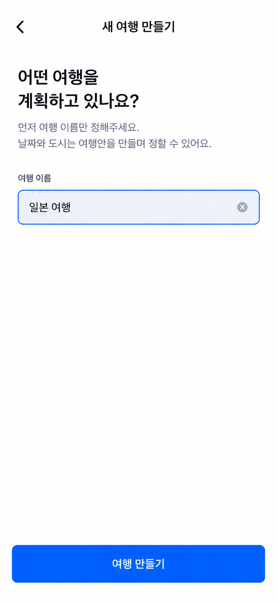

- 여행 이름 입력 하나와 `여행 만들기` CTA만 남겨 생성 목적에 집중한다.
- 큰 질문형 제목, 보조 설명, TDS형 입력 영역과 고정 파란 CTA로 기존 화면의 시각 언어를 이어간다.
- 입력값이 유효한 활성 상태를 최종 시각 기준으로 사용하며, 키보드가 열린 상태에서는 같은 CTA를 키보드 위에 배치한다.

생성 이미지는 정보 계층과 시각 방향의 최종 기준이다. 실제 구현에서는 TDS 입력 컴포넌트와 `BottomCTA.Single`을 사용한다.

## 19. 다음 구체화 대상

다음은 `IN-01 초대장`을 구체화한다.
