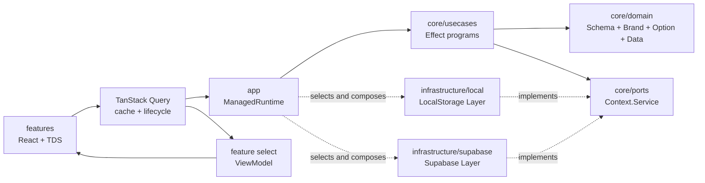

# 갈란다 Effect-first 아키텍처 결정

## 1. 문서 목적

이 문서는 갈란다 MVP의 애플리케이션 구조와 의존성 방향을 정의한다. 기술 선택과 버전은 [갈란다 기술 스택 결정](./2026-08-16-galanda-technical-stack.md), URL과 화면 이동은 [라우팅 아키텍처 결정](./2026-08-16-galanda-routing-architecture-brainstorm.md)을 따른다.

채택한 패턴은 **Effect-first Clean Architecture + Ports and Adapters + 화면 단위 Vertical Slice**다. Effect v4를 애플리케이션 로직의 기본 실행 모델로 사용하되, React 컴포넌트는 ViewModel만 렌더링한다.

## 2. 핵심 결정

- 도메인 모델, 계산, 검증, Use Case와 모든 데이터 접근 프로그램에 Effect v4를 적용한다.
- TanStack Query는 React 서버 상태 캐시와 화면 생명주기만 담당한다.
- Effect 도메인 타입은 feature의 presentation adapter에서 ViewModel로 변환한다.
- Port는 `TripRoomRepository`처럼 도메인 단위로 정의한다.
- 운영용 Supabase Layer와 개발·데모용 LocalStorage Layer가 같은 Port를 구현한다.
- 애플리케이션 전체에서 하나의 `ManagedRuntime`을 사용한다.
- 운영 권한과 원자성의 최종 보장은 Supabase RLS와 Database Functions가 담당한다.

## 3. 의존성 방향



의존성은 바깥에서 안쪽으로만 향한다. `core`는 React, TanStack Query, Supabase, LocalStorage와 앱인토스 SDK를 import하지 않는다. Effect는 core에서 허용하는 유일한 애플리케이션 프레임워크 의존성이다.

## 4. 디렉터리 구조

초기 구조는 다음을 기준으로 하되, 실제 기능이 생길 때 필요한 파일만 추가한다.

```text
src/
├── app/
│   ├── app-layer.ts
│   ├── router.tsx
│   ├── runtime.ts
│   └── query-client.ts
├── core/
│   ├── domain/
│   ├── calculations/
│   ├── ports/
│   └── usecases/
├── infrastructure/
│   ├── local/
│   └── supabase/
└── features/
    ├── plan-home/
    └── plan-detail/
```

빈 디렉터리나 향후 사용을 예상한 인터페이스를 미리 만들지 않는다. 두 feature에서 실제로 공유되는 코드가 생기기 전에는 별도 `shared/` 계층도 만들지 않는다.

## 5. Core 영역

### 5.1 Domain

- `Schema`: 입력, 저장 데이터와 외부 응답을 신뢰할 수 있는 도메인 값으로 변환한다.
- `Brand`: `TripId`, `PlanId`, `UserId`처럼 구조가 같아도 서로 섞이면 안 되는 값을 구분한다.
- `Option`: 값의 부재가 도메인 의미를 가질 때 사용한다.
- `Data` 및 `Schema.TaggedError`: 비교 가능한 값과 예상 가능한 도메인 오류를 표현한다.

도메인에서 공개하는 계산·검증 API는 Effect 프로그램으로 제공한다. 단순한 내부 변환은 순수 함수로 유지할 수 있지만, 실패·의존성·취소 또는 여러 단계를 조합하는 공개 연산은 임의의 `throw`나 `Promise` 대신 Effect로 표현한다.

### 5.2 Ports

Port는 데이터베이스의 `find`, `save`, `transaction` 같은 범용 기능이 아니라 애플리케이션이 필요로 하는 도메인 연산을 정의한다.

예시는 다음과 같다.

- `getRoom(roomId)`
- `saveDraft(draft, expectedRevision)`
- `confirmPlan(planId, expectedRevision)`
- `leaveOpinion(planId, opinion)`

Port는 `Context.Service`로 정의하고 LocalStorage와 Supabase 구현에서 같은 성공 값과 예상 오류를 반환한다. Use Case마다 별도 Port를 만들지 않는다.

### 5.3 Use Cases

Use Case는 여러 도메인 규칙이나 Port 연산을 하나의 사용자 시나리오로 조합한다. 단순 조회를 전달만 하는 Use Case는 만들지 않는다. 여행안 확정처럼 권한 확인, 충돌 처리와 여러 상태 변경이 결합되는 시나리오에만 명시적인 Use Case를 둔다.

## 6. Infrastructure 영역

### 6.1 LocalStorage Layer

LocalStorage 구현은 서버 없이 화면과 시나리오를 빠르게 개발·시연하기 위한 단일 기기 저장소다.

- 시드 데이터 초기화와 가상 사용자 전환을 제공한다.
- 저장된 JSON은 읽을 때마다 동일한 Domain Schema로 검증한다.
- `revision`과 `Conflict` 오류로 기본적인 낙관적 충돌을 모방한다.
- Supabase Layer와 같은 Port 계약 테스트를 통과해야 한다.
- 실제 보안, 다중 사용자 동시성, Realtime 또는 온라인 복귀 동기화는 제공하지 않는다.
- 데이터 형식이 개발 중 바뀌면 복잡한 마이그레이션 대신 개발 데이터 초기화를 허용한다.

LocalStorage의 권한 검사는 개발 시나리오 검증용이며 보안 경계가 아니다.

### 6.2 Supabase Layer

Supabase 구현은 운영 환경의 영속성, 권한과 원자성을 담당한다.

- Supabase 응답을 Domain Schema로 검증한다.
- 라이브러리 및 PostgreSQL 오류를 공통 애플리케이션 오류로 변환한다.
- 행 접근 권한은 JWT 사용자와 RLS로 보장한다.
- 여러 행을 함께 변경해야 하는 연산은 Database Function으로 원자적으로 처리한다.
- `revision` 또는 동등한 조건을 사용해 오래된 쓰기를 `Conflict`로 변환한다.

RLS나 트랜잭션 API 자체를 Port로 추상화하지 않는다. 두 구현체는 이를 통해 보장해야 하는 도메인 연산의 결과만 공유한다.

## 7. 사용자와 권한 경계

Repository 메서드는 권한 판단을 위해 클라이언트가 지정한 `actorId`를 받지 않는다.

- Supabase 환경에서는 인증된 JWT 사용자가 권한 주체이며 RLS가 이를 검증한다.
- LocalStorage 환경에서는 `LocalSessionLayer`가 선택한 가상 사용자를 권한 주체로 사용한다.
- 현재 사용자 조회가 필요하면 별도의 작은 `Session` 서비스를 사용한다.

따라서 `getRoom(actorId, roomId)`가 아니라 `getRoom(roomId)` 형태를 사용한다. 전달받은 사용자 ID를 신뢰하여 운영 권한을 우회하는 구현은 허용하지 않는다.

## 8. App Runtime과 Layer 구성

`ManagedRuntime.make(AppLayer)`로 애플리케이션 전체에서 재사용하는 Runtime 하나를 만든다. Runtime은 Layer를 최초 실행 시 한 번 구성하고 이후 query와 mutation에서 공유한다.

```text
ManagedRuntime
└── AppLayer
    ├── LocalProfile
    │   ├── LocalSessionLayer
    │   └── LocalTripRoomRepositoryLayer
    └── SupabaseProfile
        ├── SupabaseSessionLayer
        └── SupabaseTripRoomRepositoryLayer
```

실행 프로필은 애플리케이션 부트스트랩에서 한 번 선택한다. feature와 core는 선택된 구현체를 알지 못한다. Runtime은 테스트 종료와 개발 HMR 정리 시 dispose하며, feature별 Runtime은 만들지 않는다.

## 9. TanStack Query와 Presentation 경계

데이터 흐름은 다음과 같다.

```text
queryFn
  -> Effect Use Case
  -> Domain Port
  -> LocalStorage 또는 Supabase Layer
  -> Schema 검증
  -> Domain 모델
  -> TanStack Query select
  -> ViewModel
  -> React 컴포넌트
```

- `queryFn`과 `mutationFn`은 `ManagedRuntime`으로 Effect 프로그램을 실행한다.
- query의 `AbortSignal`을 `runPromise`에 전달하여 화면에서 불필요해진 작업을 취소한다.
- 재시도, 타임아웃과 오류 분류는 Effect가 담당하고 TanStack Query의 자동 `retry`는 비활성화한다.
- TanStack Query는 query key, 캐시, stale/gc 정책과 mutation 성공 후 invalidation을 담당한다.
- `select` 또는 feature의 presentation adapter가 Domain 모델을 평범한 ViewModel로 변환한다.
- React 컴포넌트는 `Effect`, `Option`, Repository 또는 Supabase를 직접 import하지 않는다.
- 범용 `useEffectQuery` 같은 추가 훅 계층은 만들지 않는다.

예상 가능한 Effect 오류는 feature 경계에서 화면 상태와 사용자 메시지로 변환한다. 결함과 예상 오류를 하나의 문자열 오류로 합치지 않는다.

## 10. 의도적으로 제외한 범위

- `@effect/atom-react`: 현재 React 18과 호환되지 않으므로 제외한다.
- 사용자용 오프라인 모드와 양방향 동기화: MVP 범위가 아니다.
- Supabase Realtime: 초기 데이터 경로에서 제외하고 필요가 검증되면 Query invalidation 신호로 추가한다.
- 범용 데이터베이스 추상화와 ORM 형태의 Port: 만들지 않는다.
- feature별 Runtime, Use Case별 Port, 중복 캐시 계층: 만들지 않는다.

## 11. 구현 전 확인 사항

- 설치된 `effect`와 `repos/effect`를 동일한 `4.0.0-rc.109` 태그로 맞춘다.
- TypeScript strict 모드를 활성화한다.
- LocalStorage와 Supabase Layer에 적용할 최소 공통 계약 테스트 시나리오를 먼저 정의한다.
- 첫 수직 기능에서 Schema decode, Port, 두 Layer, Runtime, Query와 ViewModel 경계를 끝까지 검증한 뒤 다른 기능으로 확장한다.
