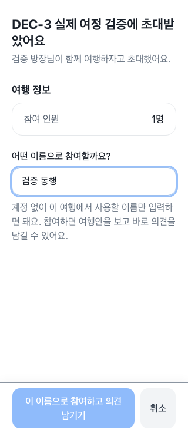
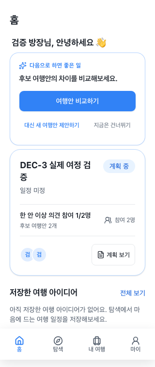
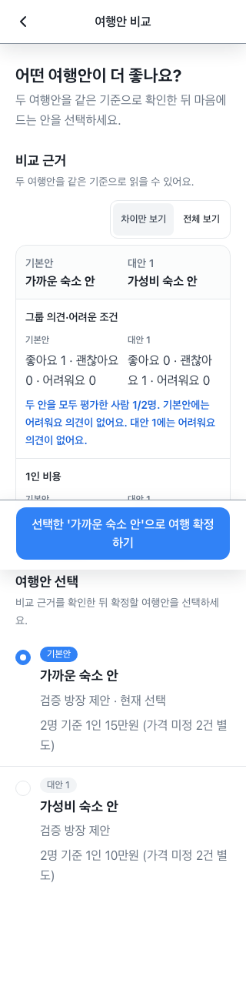
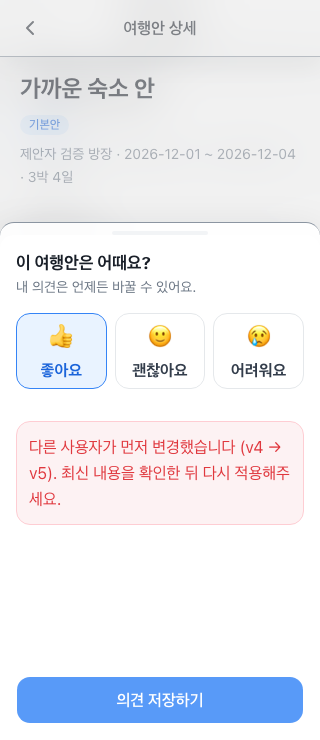

# Decision Cockpit → 초대·의견·비교·확정 검증

검증일: 2026-09-05. 범위: RAON-295 및 상위 RAON-292의 Web/PWA 완료 조건.
DEC-1은 PR #119, DEC-2는 PR #120으로 main에 반영되어 있다.

## DEC-3 동작

- 공개 초대 요약의 공개 범위를 유지한다. 제공된 여행 맥락과 계정 없이 닉네임으로 참여할 수 있다는 안내를 표시한다. 누락된 날짜·목적지를 만들어내지 않는다.
- 익명 인증 직후 실제 세션을 다시 조회한다. join 응답의 첫 미응답 `VOTING` 안으로 이동하며, 이전 participant alias의 의견도 이미 응답한 것으로 처리한다. 후보가 없거나 모두 응답했거나 확정된 방이면 명시적인 Plan Home으로 이동한다. 초대 경로는 history에서 replace된다.
- 상세의 기존 `내 의견 남기기` 한 번으로 의견 입력을 시작한다. 중복 join 방지와 저장 실패 시 입력 보존을 유지한다.
- 로그인에 비교·의견·확정 사용 장면을 표시한다. Kakao/Toss, upgrade, `safeReturnTo`는 기존 계약을 사용한다.
- 기존 featured-trip projection과 서버 NBA에 `HOME` surface를 연결한다. 동일한 resolver/정책/RBAC로 강조 행동 하나를 표시하고 클릭 시 최신 방 권한을 재검증한다. 새 홈 추천 엔진은 없다.
- HOME의 보조 링크는 outline으로 표시하고, 비교 대상 없는 기존 shortcut은 제거했다. 방 mutation은 overview도 같은 query prefix로 무효화해 의견 저장·후보 변경·확정 후 추천이 갱신된다.
- 어느 한 후보에 응답한 것만으로 의견 행동을 완료 처리하지 않는다. 모든 후보에 응답해야 `GIVE_OPINION`이 eligible 목록에서 빠진다.

## 퍼널 이벤트

기존 Effect structured logger → Worker observability 경계를 사용한다. 새로운 분석 서비스나 DB는 추가하지 않는다.

| 이벤트 | 기록 시점 |
| --- | --- |
| `invite_opened` | 유효한 공개 초대 요약 조회 성공 |
| `invite_joined` | 서버 join 성공; 이미 참여한 멤버의 idempotent 재진입 포함 |
| `first_opinion_submitted` | 현재 방에 해당 세션/alias의 귀속 의견이 없을 때 첫 의견 CAS 저장 성공 |
| `compare_opened` | 비교 화면에서 유효한 두 후보가 준비됨; 서버 membership·후보 검증 후 기록 |
| `plan_confirmed` | HOST의 확정 transaction 성공 |

이벤트 속성은 `eventName`, `role`, `groupSize`, `candidateCount`, `entrySource`다. 기존 request ID·method·route template 외에 닉네임, 의견 원문, 초대 토큰, Trip/Plan/participant ID를 추가하지 않는다. `candidateCount`는 DRAFT를 제외한다. 클라이언트가 전달하는 비교 후보 ID는 검증에만 사용하며 로그에 넣지 않는다.

이 계측은 동작 건수다. 초대 재조회·재진입도 집계되므로 순사용자 전환율과 같지 않다. 첫 의견은 현재 남아 있는 귀속 의견을 기준으로 하며, 별도의 영구 사용자 추적 기록을 만들지 않는다. 비교 계측 실패는 사용자 동작을 막지 않는다. 실패한 CAS·확정, 단순 의견 수정은 성공 이벤트를 남기지 않는다.

## 검증 결과

- `pnpm check`: lint 오류 0, Vitest **143 files / 1,429 tests** 통과, Drizzle schema/drift, typecheck, Web/PWA build, AIT build 통과. 저장소의 기존 lint warning은 남아 있다.
- focused tests: 초대 익명 세션 재조회·alias·미응답/전원 응답/확정/빈 방·중복 join·세션 실패, 로그인 플랫폼/returnTo, HOME eligible action·상태 변경·overview 무효화, 후보별 미응답 resolver, 이벤트 privacy/성공 시점 및 비교 endpoint 권한/입력 검증.
- **실제 Playwright + Chromium 320×740**: 로컬 Vite → Hono/Effect Worker → PostgreSQL/Better Auth를 사용했다. API mock 없이 테스트용 HOST를 준비하고 브라우저 Guest가 닉네임으로 참여했다.
- 실제 여정: 로그인 가치 안내 → 초대 → 첫 후보 상세 → 의견 버튼 한 번 → 의견 입력 → 다른 사용자 변경으로 409 → 선택 유지·최신 revision 재시도 → 재초대 시 다음 미응답 후보 → 모두 응답 후 Plan Home → HOME NBA 비교 → 두 열 근거 확인 → 미응답·예약 위험 확인 → HOST 확정 → 확정 itinerary.
- MEMBER 확정 요청은 403. HOST의 itinerary 변경 후 Guest가 변경 내역을 열고 `확인했어요`를 눌러 acknowledged revision 2 저장을 확인했다. 브라우저 page error 0.
- 320px에서 비교 행의 두 핵심 값이 같은 y 좌표·분리된 x 좌표에 배치되고 문서 가로 overflow가 없음을 측정했다. 전체 참여 `한 안 이상`, 후보별 `이 여행안에`, 비교 쌍 `두 안을 모두 평가`의 표현과 분모를 각각 확인했다.
- 초안 복구·권한·conflict·Itinerary 관련 기존 회귀 테스트는 전체 gate에 포함해 통과했다.

Playwright 인프라는 기존 커밋 `ac2bd7c048`에서 제거되었으므로 복원하지 않았다. 이번 실제 브라우저 검증은 설치된 Playwright로 일회 실행했다. 로컬 실행 script/result는 `/tmp/raon295-browser/`에 남겼으며, 공유 가능한 렌더링 증거는 아래에 저장했다.

| 초대 | HOME 단일 강조 행동 |
| --- | --- |
|  |  |

| 두 열 비교 | 의견 충돌 복구 |
| --- | --- |
|  |  |

## RAON-292 exit 확인

DEC-1·DEC-2의 병합 상태와 함께 위 사용자 여정으로 DEC-3 및 상위 Goal의 완료 조건을 검증했다. 앱인토스는 빌드 검증만 수행했으며 실제 Toss WebView 검증이나 배포를 뜻하지 않는다. 이번 작업에는 배포 단계가 포함되지 않는다.
